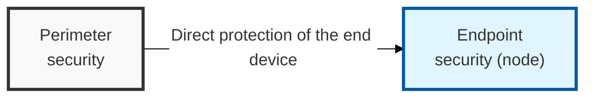
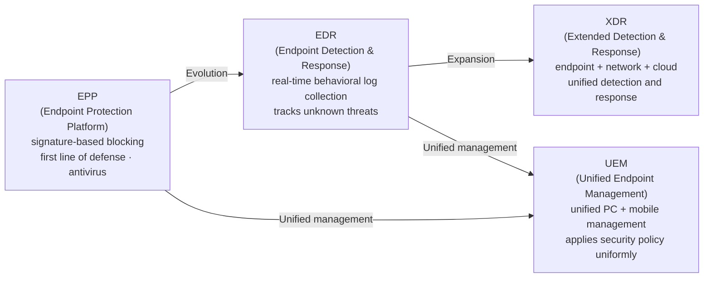
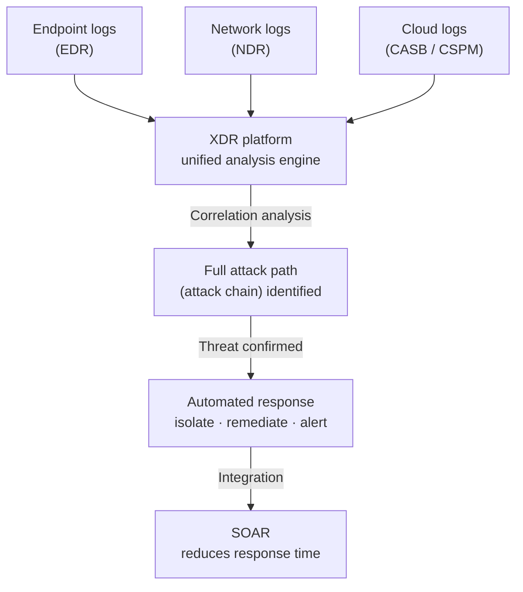

## I. Overview

**Definition**: A host-based security strategy that detects, blocks, and responds to threats that have penetrated the network and reached an end-user device.

**Why It Is Needed**:  
( **Perimeter Collapse** ) The traditional network perimeter security model has been undermined by the shift to cloud and the spread of remote work  
( **Spread of BYOD** ) Increasing use of personal devices for work (**BYOD**) exposes unauthorized devices and endpoint vulnerabilities  
( **Advancing Threats** ) Advanced persistent threats (**APT**) and ransomware increasingly use end-user devices as their primary attack foothold  

## II. Mechanism & Components

### A. Evolution of Security Solutions and Gaining Visibility

### B. Detailed Comparison of Key Security Functions

| Category | Key Technology | Description | Security Value |
|-----|---------|---------|-----------|
| Blocking | NGAV (Next-Gen Antivirus) | AI/machine-learning-based anomalous behavior detection | Defends against non-signature-based attacks |
| Detection | Behavioral Analysis | Tracks behavior such as file execution and registry modification | Detects zero-day attacks |
| Control | DLP (Data Loss Prevention) | Controls removable media, prevents screen capture, blocks file exfiltration | Prevents leakage of internal information |
| Management | Patch Management | Automates OS and application security updates | Removes vulnerabilities |

## III. Advanced Topics & Comparison

| Element | Description | Note |
|-----|---------|------|
| Data Integration | Unifies endpoint, network, and cloud logs into one place | Expands visibility |
| Correlation Analysis | Links fragmented events across layers to identify the full attack path | Cross-layer correlation |
| Automated Response | Automatically executes isolation and remediation when a threat is detected | Integrates with SOAR and cuts response time |

> **Key point**: XDR is a next-generation, unified security platform that extends EDR's endpoint visibility to the network and cloud, overcoming the limits of fragmented security solutions by tracking the entire kill chain in a single view.
