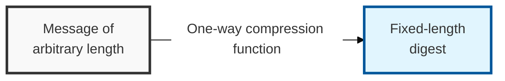

## I. Overview

**Definition**: A one-way function that takes a message of arbitrary length as input and converts it into a fixed-length bit string (hash value).

**Features**:  
( **One-Way** ) Computing the hash value from the input is easy, but recovering the input from the hash value is infeasible  
( **Avalanche Effect** ) Even a tiny change to the input produces a completely different output hash value  
( **Compression** ) Regardless of the length of the input, the function always produces a hash value of a fixed, predetermined length  

## II. Mechanism & Components

### A. Three Core Security Properties of Hash Functions

| Security Property | Description | Note |
|:---:|----------|----------|
| 1. **Preimage Resistance** | For a given hash value `h`, it is difficult to find an input `x` such that `H(x) = h` | Guarantees one-wayness |
| 2. **Second Preimage Resistance** | For a given input `x`, it is difficult to find a different input `x'` such that `H(x) = H(x')` | Prevents tampering with an existing document |
| 3. **Collision Resistance** | It is difficult to find any two distinct inputs `x` and `x'` such that `H(x) = H(x')` | Guarantees signature integrity |

### B. Comparison of Major Hash Algorithms

| Algorithm | Hash Length (bits) | Features & Security Level |
|:---:|:---:|-----------------|
| **MD5** | 128 | Deprecated after collision-resistance flaws were discovered |
| **SHA-1** | 160 | Deprecated after forgery/tampering vulnerabilities were discovered |
| **SHA-2** | 224 / 256 / 384 / 512 | Currently the most widely used standard (e.g., **SHA-256**) |
| **SHA-3** | 224 / 256 / 384 / 512 | Based on the Keccak algorithm; offers structural robustness beyond SHA-2 |

## III. Vulnerabilities & Security Measures

Hash functions anchor three practical controls — file integrity verification, salted password storage, and the message digest inside every digital signature — and the choice of algorithm matters far less than whether these supporting practices are actually followed.

| Attack Vector | Primary Control |
|---|---|
| Rainbow table attacks | Salting + key stretching |
| Birthday attack (collision) | Sufficiently long hash length (256 bits or more) |
| Weak legacy algorithms (MD5, SHA-1) | Migrate to SHA-2/SHA-3; reject on ingestion |

Salting is the control most teams treat as optional rather than mandatory, but an unsalted hash table is barely better than plaintext once a rainbow table matching that algorithm exists — the entire security value of hashing passwords collapses to "how expensive is the precomputed table," which is a solved problem for MD5 and SHA-1 today. Reject any new system design that stores password hashes without a per-record salt, regardless of which hash algorithm it proposes.
