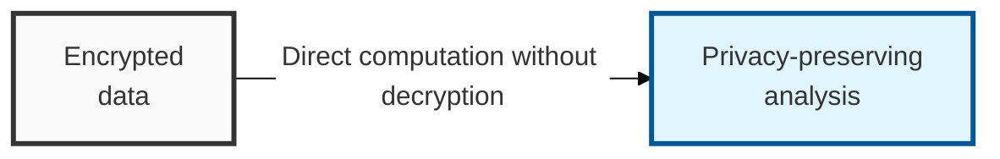

## I. Overview

**Definition**: A cryptographic system in which the result of performing an operation on ciphertext `Enc(m)` of plaintext `m` remains equivalent to the result of performing the operation on the plaintext and then encrypting it.

**Core Value**:  
( **Privacy Preservation** ) Computation can be performed on data while it remains encrypted, without ever decrypting it to plaintext  
( **Maximized Data Utility** ) Enables data analysis using external resources such as the cloud while protecting sensitive information  
( **Mathematical Safety** ) Can simultaneously achieve quantum-resistant security by relying on techniques such as lattice-based cryptography  

## II. Mechanism & Components

### A. Stages of Development by Computational Scope

| Category | Generation | Features & Limitations |
|------|-----|-------------|
| Partially Homomorphic (PHE) | 1st generation | Supports only one operation — either addition or multiplication (RSA, ElGamal) |
| Somewhat Homomorphic (SHE) | 2nd generation | Supports both addition and multiplication, but with a limit on the number of operations |
| Fully Homomorphic (FHE) | 3rd generation | Supports unlimited logical/arithmetic operations with no count restriction (Gentry, 2009) |

### B. Core Technologies of Fully Homomorphic Encryption (FHE)

| Core Technology | Description | Note |
|----------|---------|------|
| Lattice-based cryptography | Encryption based on the mathematical hardness of lattice structures (e.g., LWE) | Provides quantum resistance (PQC) |
| Bootstrapping | Removes accumulated **noise** during computation so that operations can continue | The key technology enabling FHE |
| Packing | Places multiple pieces of data into a single ciphertext for parallel processing | Improves computational efficiency |

## III. Comparison & Application

| Comparison Item | Homomorphic Encryption | Differential Privacy (DP) |
|----------|----------------------------------|-------------------------------------|
| Security Mechanism | Mathematical encryption (access control) | Mathematical noise injection (data perturbation) |
| Data Form | Ciphertext (results also remain encrypted) | Statistical values (results are plaintext but contain error) |
| Computational Accuracy | 100% accurate (identical to plaintext once decrypted) | Approximate (error introduced by noise) |
| Key Limitation | High computational load (CPU/memory consumption) | Loss of data utility (privacy budget management) |

These solve different problems and shouldn't be picked from a single menu — reach for homomorphic encryption when a third party must compute on data it is never allowed to see in the clear (outsourced cloud computation), and reach for differential privacy when the goal is publishing aggregate statistics without exposing any individual record. Treating FHE's computational overhead as a reason to fall back to DP for an outsourced-computation use case just reintroduces the plaintext-exposure risk DP was never designed to close.
