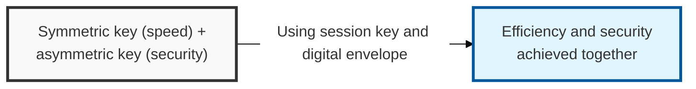
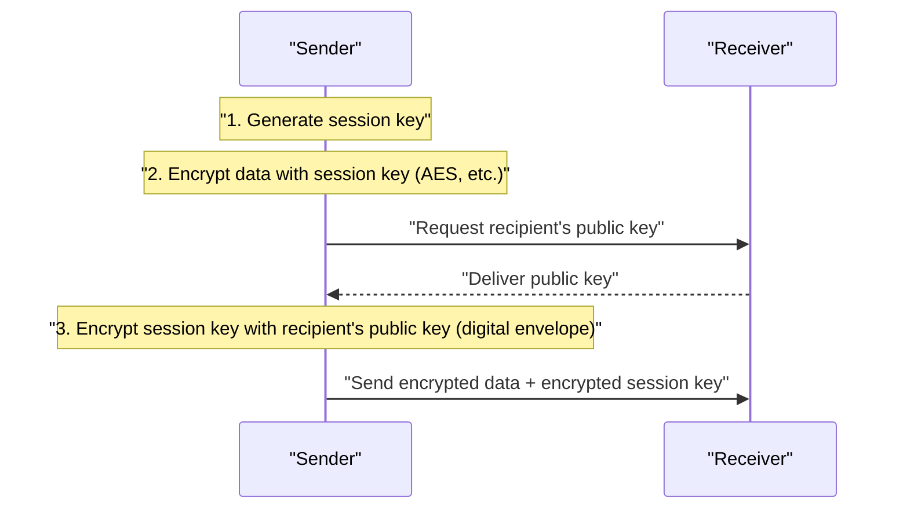

## I. Overview

**Definition**: An integrated cryptographic scheme that encrypts large volumes of data using symmetric-key cryptography, while protecting and delivering the symmetric key used in that process with asymmetric-key (public-key) cryptography.

**Features**:  
( **Solves the Key Distribution Problem** ) Asymmetric-key cryptography resolves the key distribution problem, which is the main drawback of symmetric-key cryptography  
( **Computational Efficiency** ) Bulk data is encrypted with the symmetric key, overcoming the speed penalty of asymmetric-key cryptography  
( **Strengthened Security** ) Combines data encryption with a key-exchange method, achieving overall security and efficiency at the same time  

## II. Mechanism & Components

### A. Hybrid Encryption Process

**Detailed steps**:
- **Generate session key**: The sender generates a one-time symmetric key (session key) to encrypt the data
- **Encrypt data**: The generated session key transforms the plaintext into ciphertext (using AES, etc.)
- **Encrypt session key**: The session key itself is encrypted using the recipient's **public key** (creating the digital envelope)
- **Transmission**: The encrypted data and the encrypted session key are sent to the recipient

### B. Hybrid Decryption Process

- **Decrypt session key**: The recipient uses their own **private key** to recover the encrypted session key
- **Decrypt data**: The recovered session key is used to convert the received ciphertext back into plaintext

## III. Advanced Topics & Comparison

| Comparison Item | Symmetric-Key Cryptography | Asymmetric-Key Cryptography | Hybrid Cryptography |
|----------|-----------------------|-------------------------|-----------------------|
| **Main Algorithms** | AES, DES, ARIA | RSA, ECC, Diffie-Hellman | SSL/TLS, S/MIME, PGP |
| **Key Management/Distribution** | Difficult (`N(N-1)/2`) | Easy (`2N`) | Key distribution solved via asymmetric keys |
| **Processing Speed** | Very fast | Very slow | Retains symmetric-key speed |
| **Core Use** | Encrypting large volumes of data | Key exchange, digital signatures | Web communication (HTTPS), email |
