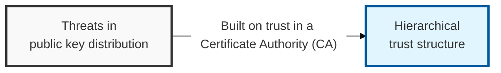
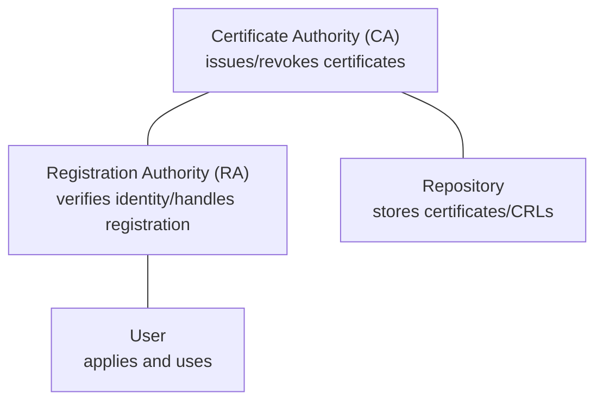

## I. Overview

**Definition**: A hierarchical trust structure that performs user identification, and certificate issuance, storage, distribution, and revocation, so that public-key cryptography can be used safely.

**Necessity**:  
( **Establishing a Trust Model** ) A framework is needed to guarantee the trustworthiness of a public key within an asymmetric-key cryptographic system  
( **Preventing MITM Attacks** ) Blocks the man-in-the-middle attacks that can occur during public key distribution  
( **Integrated Management System** ) Requires infrastructure to manage the full lifecycle of a certificate — issuance, storage, distribution, and revocation  

## II. Mechanism & Components

### A. Core PKI Entities

- **CA (Certificate Authority)**: The top-level trusted entity responsible for issuing and revoking certificates and managing the CRL
- **RA (Registration Authority)**: Verifies user identity and handles registration on behalf of the CA (distributing the CA's workload)
- **Repository**: A directory such as LDAP that stores certificates and the CRL (certificate revocation list)
- **User**: The party using the service (sender/recipient)

### B. Certificate Issuance and Verification Process

| Step | Key Activity | Details |
|:---:|--------------|----------|
| 1. **Registration** | Verify user identity | Offline or online face-to-face verification via the RA |
| 2. **Issuance** | Generate certificate | The CA embeds the user's public key and information, and signs it with the CA's private key |
| 3. **Verification** | Confirm trustworthiness | The recipient verifies the signature inside the certificate using the CA's public key |
| 4. **Revocation** | Manage loss of validity | If revoked before expiry, it is registered in the CRL or via OCSP |

## III. Comparison & Application

| Comparison Item | Hierarchical Model | Network (Mesh) Model |
|----------|-------------------------|-------------------|
| **Structure** | Tree structure centered on a Root CA | Mutual authentication between CAs (cross-certification) |
| **Trust Path** | One-way, top to bottom | Bidirectional or a more complex path |
| **Advantage** | Management is centralized and clear | High integration and scalability across organizations |
| **Example** | National accredited certification systems, SSL/TLS | Cross-organizational federated security systems |

Default to the hierarchical model unless cross-organizational federation is an explicit requirement — a single Root CA gives auditors and administrators one place to reason about trust, while mesh cross-certification multiplies the number of trust paths that must be validated and creates transitive-trust risk that is easy to overlook until a partner CA is compromised. Reserve mesh PKI for scenarios where no single organization can credibly serve as the root.
