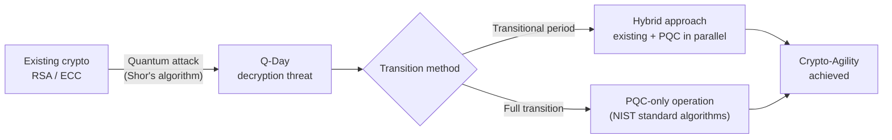

## I. Overview

**Definition**: Next-generation cryptographic algorithms designed around complex mathematical problems that remain difficult to solve even with the immense computing power of a quantum computer.

**Necessity**:  
( **Responding to the Quantum Threat** ) Preparing for the collapse of existing cryptographic systems due to the immense computing power of quantum computers  
( **Achieving Crypto-Agility** ) A flexible cryptographic architecture is required so that new security threats can be responded to quickly  
( **Long-Term Security** ) Proactively strengthens security for critical national infrastructure — public, financial, and defense sectors — in preparation for a future Q-Day  

## II. Mechanism & Components

### A. Fundamental Principles and Transition Architecture

> **Key point**: A "hybrid" approach — running existing cryptography alongside post-quantum cryptography — is emerging as the leading transitional strategy.

### B. Major Algorithm Families by Mathematical Foundation

| Category | Mathematical Basis & Features | Representative Algorithms |
|------|------------------------|:------------:|
| Lattice-based | Uses the shortest vector problem (SVP) within a lattice structure; the most efficient and widely used approach | Kyber, Dilithium |
| Code-based | Uses the difficulty of decoding error-correcting codes; long track record of security validation, but larger key sizes | McEliece |
| Multivariate (MV) | Uses the difficulty of solving multivariate quadratic polynomial systems; fast signing speed | Rainbow |
| Hash-based | Uses the security of one-way hash functions; very strong quantum resistance | SPHINCS+ |

## III. Advanced Topics & Comparison

- **NIST Standardization**: Compatibility with existing IT infrastructure must be validated around the standard algorithms selected by NIST (Kyber and others)
- **Crypto-Agility**: Establishing a flexible security architecture that can rapidly transition to a new cryptographic system is essential
- **K-PQC Initiative**: Developing a domestically suited post-quantum cryptographic algorithm and prioritizing its rollout in the public and financial sectors is an urgent task
