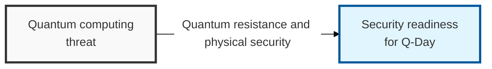

## I. Overview

**Definition**: Security technologies developed to counter the threat that quantum computers' immense computing power (such as Shor's algorithm) poses to modern asymmetric-key cryptographic systems.

**Features**:  
( **Physical Security** ) Blocks physical eavesdropping by exploiting the properties of quantum mechanics through Quantum Key Distribution (QKD)  
( **Use of Hard Mathematical Problems** ) Strengthens security by using complex algorithms (PQC) that remain hard to solve even with a quantum computer  
( **Forward-Looking Response** ) Protects existing cryptographic systems from quantum threats such as Shor's algorithm  

## II. Mechanism & Components

### A. Comparing QKD and PQC

| Comparison Item | Quantum Key Distribution (QKD) | Post-Quantum Cryptography (PQC) |
|----------|-------------------|-------------------|
| **Security Principle** | Physical properties of quantum mechanics (superposition, no-cloning) | Hard mathematical problems (lattice, multivariate, code-based, etc.) |
| **Implementation** | Requires dedicated hardware and fiber-optic cable | Software upgrade (reuses existing infrastructure) |
| **Transmission Distance** | Distance-limited (signal attenuation) | No distance limit (works over any network segment) |
| **Scalability** | Low scalability due to hardware cost | High scalability, replacing existing crypto algorithms |
| **Primary Purpose** | Secure key exchange | Authentication, signing, and encryption across the board |

### B. The Core of PQC: Lattice-Based Cryptography

**Concept**: A cryptographic method that exploits the mathematical hardness of the "Shortest Vector Problem (SVP)" or "Closest Vector Problem (CVP)" within an `n`-dimensional lattice structure.

**Major algorithms**: Kyber (public-key encryption/KEM) and Dilithium (digital signatures), both selected as NIST standards.

**Features**:
- Difficult to break not only by quantum computers but also by high-performance supercomputers
- Fast computation speed and relatively efficient key sizes
- Also used as the foundational technology for fully homomorphic encryption (FHE)

## III. Advanced Topics & Comparison

| Stage | Initiative | Details |
|:---:|----------|----------|
| 1. **Apply Hybrid Approach** | Achieve crypto-agility | Combine existing cryptography with PQC to secure both security and compatibility at once |
| 2. **Upgrade Infrastructure** | Deploy QKD on national/enterprise core networks | Build physical network infrastructure for segments requiring extremely high trust, such as finance and defense |
| 3. **Standardize and Transition** | Adopt NIST standard algorithms | Gradually replace systems with standardized PQC algorithms (Kyber, etc.) |
