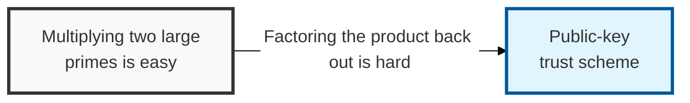
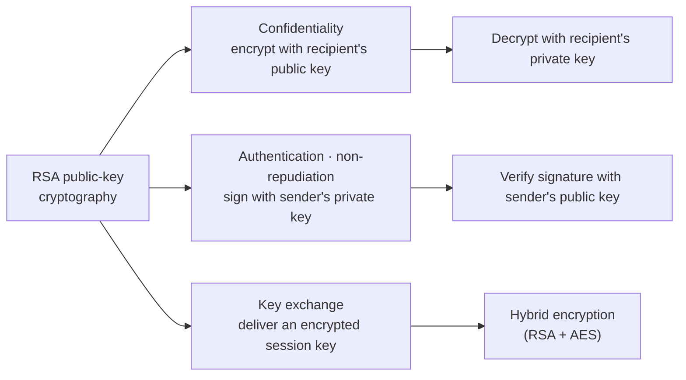
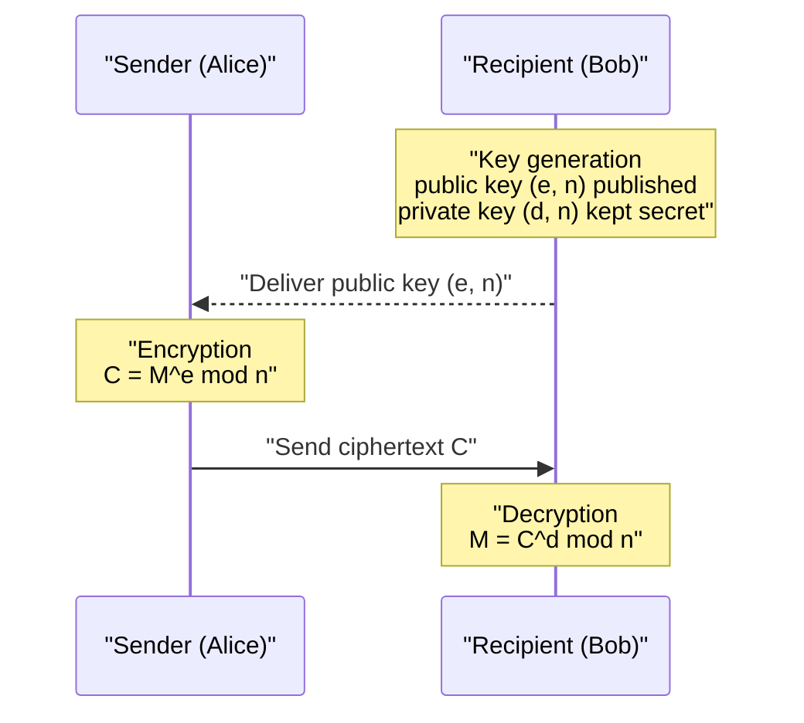
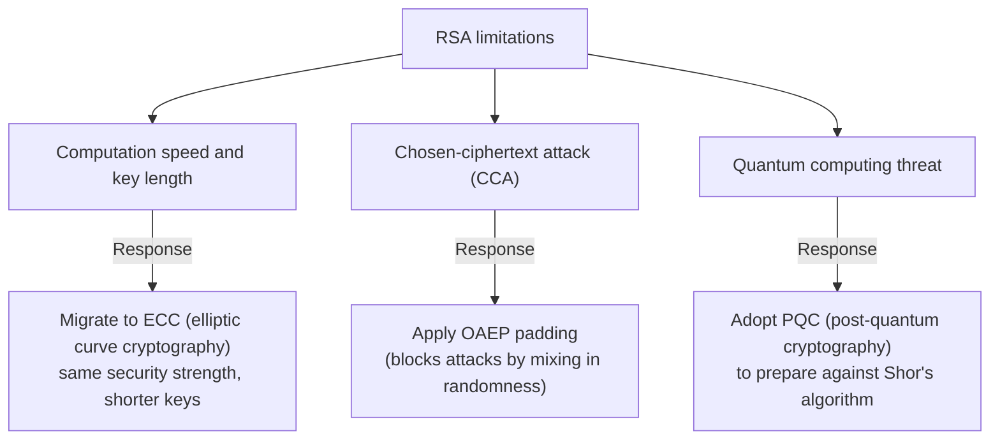

## I. Overview

**Definition**: A public-key algorithm built on the fact that multiplying two prime numbers together is easy, but recovering the original primes from that product is hard.

**Features**: In addition to confidentiality, RSA provides authentication and non-repudiation through digital signatures, and a key length of 2048 bits or more is recommended depending on the data.

## II. Mechanism & Components

### A. Key Generation and Encryption/Decryption

**Key generation procedure**:

1. Choose two large primes `p` and `q`, and compute `n = p × q`
2. Compute Euler's totient: `φ(n) = (p-1)(q-1)`
3. Choose a public exponent `e` that is coprime to `φ(n)`
4. Compute a private exponent `d` satisfying `e × d ≡ 1 (mod φ(n))`
5. **Public key**: `(e, n)` / **Private key**: `(d, n)`

| Operation | Formula |
|-----|------|
| Encryption | `C = M^e mod n` |
| Decryption | `M = C^d mod n` |

### B. Key Security Properties of RSA

| Item | Details |
|-----|---------|
| Security Basis | The integer-factorization problem — extracting `p` and `q` from an `n` of several thousand bits or more is computationally infeasible |
| Use 1: Confidentiality | Encrypted with the recipient's public key → decrypted with the recipient's private key |
| Use 2: Authentication | Encrypted (signed) with the sender's private key → verified with the sender's public key |
| Constraint | Slower than symmetric-key cryptography, so it is used mainly for "session key encryption" or "signing" only |

## III. Vulnerabilities & Security Measures

| Limitation | Response |
|------|---------|
| Computation speed and key length | Migrate to **ECC (elliptic curve cryptography)**, which offers better computational efficiency for the same security strength |
| Chosen-ciphertext attack (CCA) | Apply **OAEP**, a padding technique that mixes randomness into the data |
| Quantum computing threat | Can be defeated by Shor's algorithm → adoption of **PQC (post-quantum cryptography)** is required |

Textbook (unpadded) RSA is the vulnerability practitioners are most likely to reintroduce by accident, not the quantum threat — any implementation or library defaulting to raw RSA without OAEP padding is exploitable today via chosen-ciphertext attacks, while the quantum threat still has a migration runway ahead of it. Audit for correct padding usage first; treat the PQC transition as the longer-horizon project it actually is.
