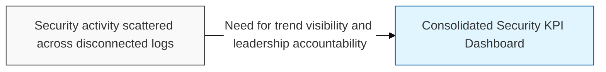
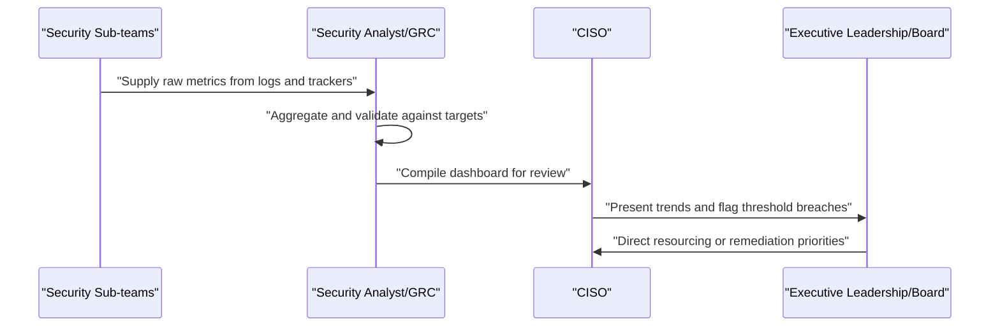

## I. Overview

A Security KPI Dashboard aggregates recurring metrics — patch latency, phishing test results, incident counts, access recertification completion, and similar indicators — into a single reporting view that tracks the health of the security program over time. It is owned by the CISO and compiled by the security team from underlying logs, tickets, and trackers, then presented to executive leadership and the board on a fixed cadence. It matters because individual logs and registers show operational detail but do not, on their own, answer the governance question leadership needs answered: is the security posture improving, stable, or degrading, and where should investment go next.

## II. Structure & Process

| Field | Description |
|---|---|
| Metric Name | The indicator being tracked, e.g. mean time to detect, patch compliance rate. |
| Data Source | The underlying log or system the metric is pulled from. |
| Current Value | Latest measured value for the reporting period. |
| Target/Threshold | Goal or acceptable range set by the security program. |
| Trend | Direction of change versus the prior reporting period. |
| Reporting Owner | Person accountable for accuracy of this metric. |
| Reporting Frequency | How often the metric is refreshed, e.g. weekly, monthly, quarterly. |
| Escalation Trigger | Condition under which the metric prompts leadership escalation. |

Underlying metrics are refreshed continuously or weekly depending on the source system, the consolidated dashboard is compiled monthly, and a summarized version is presented to executive leadership or the board on a quarterly cycle.

## III. Best Practices & Comparison

| Document | Primary Purpose | Update Cadence | Owner |
|---|---|---|---|
| Security KPI Dashboard | Summarize program-wide security trends for leadership | Monthly, presented quarterly | CISO |
| Data Loss Prevention (DLP) Incident Log | Source detail feeding exfiltration-related metrics | Per alert | Security operations |
| Access Rights & Permissions Matrix | Source detail feeding access recertification completion metrics | Continuous | IAM/Security team |

- Limit the dashboard to a small set of metrics leadership can act on, rather than every number the security team happens to collect.
- Pair each metric with a defined target and an explicit escalation trigger so a breach of threshold produces a decision, not just a color change.
- Pull metrics directly from source logs and trackers rather than re-entering figures manually, to avoid drift between the dashboard and underlying evidence.
- Track trend direction alongside current value, since a single snapshot cannot show whether the program is improving.
- Revisit the metric set annually to retire indicators that no longer drive decisions and add ones tied to emerging risks.

Related: [Data Loss Prevention (DLP) Incident Log](../data-loss-prevention-incident-log/), [Access Rights & Permissions Matrix](../access-rights-permissions-matrix/).
