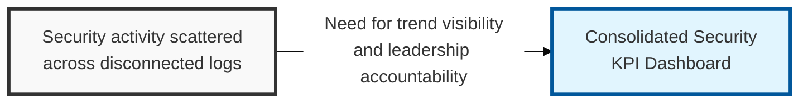
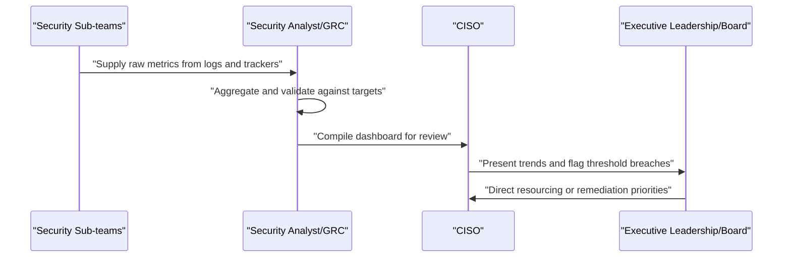

## I. Overview

**Definition**: A Security KPI Dashboard aggregates recurring metrics into a single reporting view that tracks the health of the security program over time.

**Features**:  
( **Ownership** ) Owned by the CISO and compiled by the security team from underlying logs, tickets, and trackers, then presented to executive leadership and the board on a fixed cadence.  
( **Metric Coverage** ) Spans patch latency, phishing test results, incident counts, access recertification completion, and similar indicators.  
( **Governance Answer** ) Answers the governance question individual logs and registers cannot on their own: is the security posture improving, stable, or degrading.  
( **Investment Guidance** ) Indicates where security investment should go next.

## II. Structure & Process

| Field | Description |
|---|---|
| Metric Name | The indicator being tracked, e.g. mean time to detect, patch compliance rate. |
| Data Source | The underlying log or system the metric is pulled from. |
| Current Value | Latest measured value for the reporting period. |
| Target/Threshold | Goal or acceptable range set by the security program. |
| Trend | Direction of change versus the prior reporting period. |
| Reporting Owner | Person accountable for accuracy of this metric. |
| Reporting Frequency | How often the metric is refreshed, e.g. weekly, monthly, quarterly. |
| Escalation Trigger | Condition under which the metric prompts leadership escalation. |

Underlying metrics are refreshed continuously or weekly depending on the source system, the consolidated dashboard is compiled monthly, and a summarized version is presented to executive leadership or the board on a quarterly cycle.

## III. Expected Benefits & Implications

A dashboard with too many metrics produces the opposite of its intended effect — leadership disengages from a forty-row report the same way they would a forty-page memo, so cutting the metric set down to what's actually actionable matters more than the completeness of what's tracked. Every metric without a paired target and escalation trigger is a number, not a KPI, and should be removed or upgraded.

| Benefit | Where It Shows Up | Time Horizon |
|---|---|---|
| Faster resourcing decisions | Leadership sees degrading trends before they become incidents | Ongoing, visible within 1-2 reporting cycles |
| Reduced audit friction | Trends pulled from source systems serve as ready-made evidence | At audit time |
| Program credibility | Consistent, source-linked metrics build trust that self-reported wins don't | 2-3 quarters |

- Limit the dashboard to a small set of metrics leadership can act on, rather than every number the security team happens to collect.
- Pair each metric with a defined target and an explicit escalation trigger.
- Pull metrics directly from source logs and trackers rather than re-entering figures manually, to avoid drift between the dashboard and underlying evidence.

Related: [Data Loss Prevention (DLP) Incident Log](../data-loss-prevention-incident-log/), [Access Rights & Permissions Matrix](../access-rights-permissions-matrix/).
