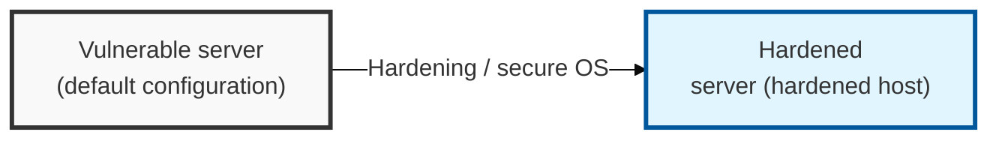
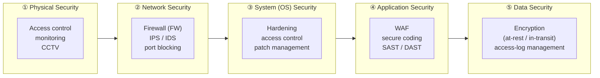
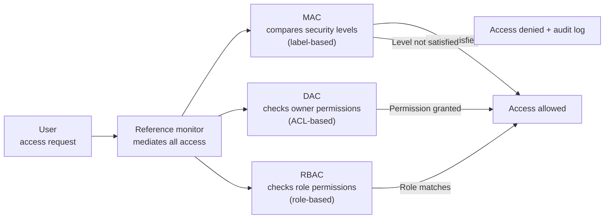

## I. Overview

**Definition**: Security activities that remove vulnerabilities in server components — the operating system, applications, database, and more — and block unauthorized access, thereby securing the confidentiality, integrity, and availability of the service.

**Key Defense Strategies**:  
( **Host Fortification** ) **Hardening**: Minimizing the attack surface by removing unnecessary services and accounts and applying the latest security patches  
( **Kernel-Level Hardening** ) **Secure OS**: Implementing strong access control through a reference monitor and **MAC (Mandatory Access Control)**  
( **Layered Defense** ) **Defense in Depth**: Layering security controls across the physical, network, system, application, and data tiers  

## II. Mechanism & Components

| Category | Key Security Technologies & Activities | Description |
|-----|------------------|---------|
| Physical Security | Access control, monitoring | Restricting physical access to data centers and server rooms |
| Network Security | Firewall (FW), IPS/IDS | Blocking unnecessary ports, network-based intrusion detection and prevention |
| System (OS) Security | Hardening, access control | Removing unnecessary services/accounts, patching kernel and OS vulnerabilities |
| Application Security | WAF, secure coding | Defending against web vulnerabilities (SQLi, XSS) and secure source-code development |
| Data Security | Encryption, access-log management | Encrypting data at rest and data in transit |

## III. Comparison & Application

| Model | Key Features | Mechanism |
|------|---------|---------|
| Mandatory Access Control (MAC) | Access is granted based on security levels set by an administrator | Security kernel, rule-based |
| Discretionary Access Control (DAC) | The resource owner grants permissions | ID-based, permission granting |
| Role-Based Access Control (RBAC) | Permissions are assigned based on the user's job/role | Role-centered within the organization |

Most enterprise systems need RBAC as the default and MAC only where regulation demands it, not the other way around — DAC alone is too permissive for anything beyond personal workstations, while pure MAC's rigid labeling overhead rarely justifies itself outside government or defense-grade classification requirements. RBAC hits the maintainability sweet spot for the access-review workload most organizations actually have to sustain.
