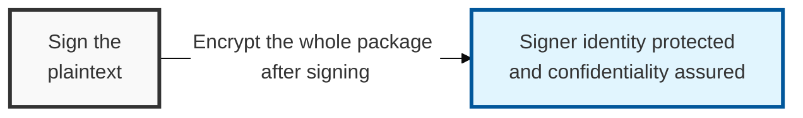
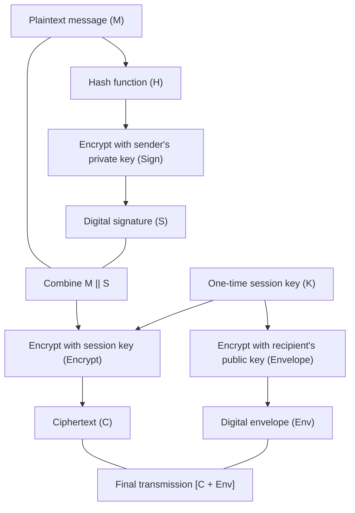

## I. Overview

**Definition**: A method in which the sender generates a digital signature over the plaintext message using their own private key, attaches it, and then encrypts the entire combination with the recipient's public key (or a session key) before transmission.

**Core Value**:  
( **Confidentiality and Integrity** ) The entire message is encrypted to protect its contents, and the signature confirms whether it has been tampered with  
( **Non-repudiation and Authentication** ) Including a signature made with the sender's private key provides identity confirmation and non-repudiation  
( **Attack Resistance** ) Encrypting even the signer's information blocks third parties from obtaining it, and it resists replay attacks  

## II. Mechanism & Components

### A. Step-by-Step Process

**Detailed mechanism**:
- **Sign step**: The message is hashed (`H`) and encrypted with the sender's private key (`Pr_A`) to produce the signature (`S`): `S = E(Pr_A, H(M))`
- **Combine step**: The original message and the signature are combined: `M' = M || S`
- **Encrypt step**: The combined message is encrypted with a symmetric session key, and the session key itself is encrypted with the recipient's public key (`Pu_B`) as a digital envelope: `C = E(K, M')`, `Env = E(Pu_B, K)`
- **Transmission**: `[C, Env]` is sent to the recipient

### B. Security Benefits and Features

| Category | Details | Security Value |
|:---:|----------|------------|
| **Authentication and Non-repudiation** | Uses the sender's private key | Provides solid evidence of "who sent it" |
| **Integrity Assured** | Includes a hash value and signature | Detects even a single-bit alteration in transit |
| **Confidentiality Maintained** | Entire package is encrypted | A third party cannot learn the message content or the identity of the signer |
| **Attack Resistance** | Defends against **surreptitious forwarding** | Resists an attack where someone intercepts only the signature and replays it |

## III. Advanced Topics & Comparison

| Comparison Item | Sign-then-Encrypt (Recommended) | Encrypt-then-Sign |
|----------|-----------------------|-------------------|
| **Order of Operations** | Sign first, then encrypt the whole thing | Encrypt first, then sign the ciphertext |
| **Signature Target** | Hash of the original message (plaintext) | Hash of the ciphertext |
| **Confidentiality Level** | High (the signer's identity is also encrypted) | Moderate (the signer may be exposed) |
| **Standard Use** | **S/MIME**, **PGP**, application-level security | **IPSec** (network layer), among others |
