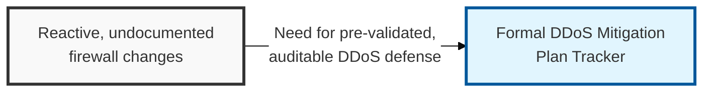
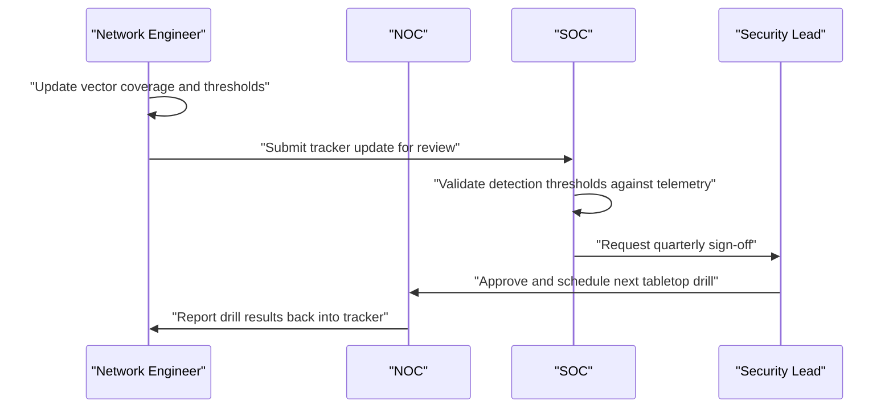

## I. Overview

**Definition**: A **DDoS** (Distributed Denial of Service) Attack Mitigation Plan Tracker is the document that inventories which attack vectors a network is prepared to withstand, and which controls, thresholds, and escalation paths cover each one.

**Features**:  
( **Ownership** ) Owned by the network security engineering team and operated jointly with the NOC and SOC during live incidents.  
( **Vector Coverage** ) Spans volumetric floods, protocol exhaustion, reflection/amplification, and application-layer floods in a single inventory.  
( **Pre-Validated Response** ) Replaces reactive, ad hoc rule changes made mid-attack with controls and thresholds validated before an incident.  
( **Traceability** ) Preserves a record of what was tried, what worked, and what capacity limits were confirmed for future incidents.

## II. Structure & Process

| Field | Description |
|---|---|
| Attack Vector | Category of DDoS threat covered, e.g. **UDP/ICMP Flood**, **TCP SYN Flood**, **DNS/NTP Reflection**, **HTTP GET Flood**, **Slowloris** |
| Mitigation Control | Defense mechanism assigned to the vector, e.g. **SYN Cookies**, **rate limiting**, **WAF** rule, **scrubbing center**, **anycast** routing |
| Detection Threshold | Traffic or connection-rate value that triggers automated or manual mitigation |
| Upstream / ISP Contact | Escalation point for volumetric attacks exceeding local link capacity |
| Runbook Reference | Link to the step-by-step response procedure for this vector |
| Last Tabletop Drill Date | Date the mitigation was last exercised or simulated |
| Drill Outcome | Pass/fail notes, time-to-mitigate, and follow-up actions |
| Owner | Individual or team accountable for keeping the control current |

The tracker is updated whenever a control changes or a drill runs, and reviewed quarterly by the security lead alongside capacity and threat-intelligence updates.

## III. Best Practices & Comparison

| Document | Primary Purpose | Update Cadence | Owner |
|---|---|---|---|
| DDoS Attack Mitigation Plan Tracker | Map attack vectors to mitigation controls and validate readiness | Quarterly + post-incident | Network Security Engineering |
| [Network Security Risk Mitigation](../network-security-risk-mitigation/) | Broad risk register across all network threats, not DDoS-specific | Quarterly | CISO / Network Security |
| NIST SP 800-41 (Firewall Guidelines) | Baseline configuration guidance for perimeter devices | As-needed on standard revision | Network Security Engineering |

- Validate every mitigation threshold against real traffic baselines, not assumed values.
- Keep at least one upstream scrubbing or ISP escalation path documented and tested.
- Re-run tabletop drills after any significant architecture or provider change.
- Record time-to-mitigate for every drill and real incident to track improvement.
- Cross-reference each vector with the OSI layer it exploits so coverage gaps are visible at a glance.

Related: [Network Traffic Monitoring Dashboard](../network-traffic-monitoring-dashboard/), [Network Security Risk Mitigation](../network-security-risk-mitigation/)
