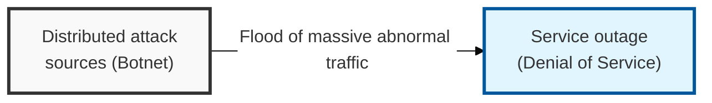
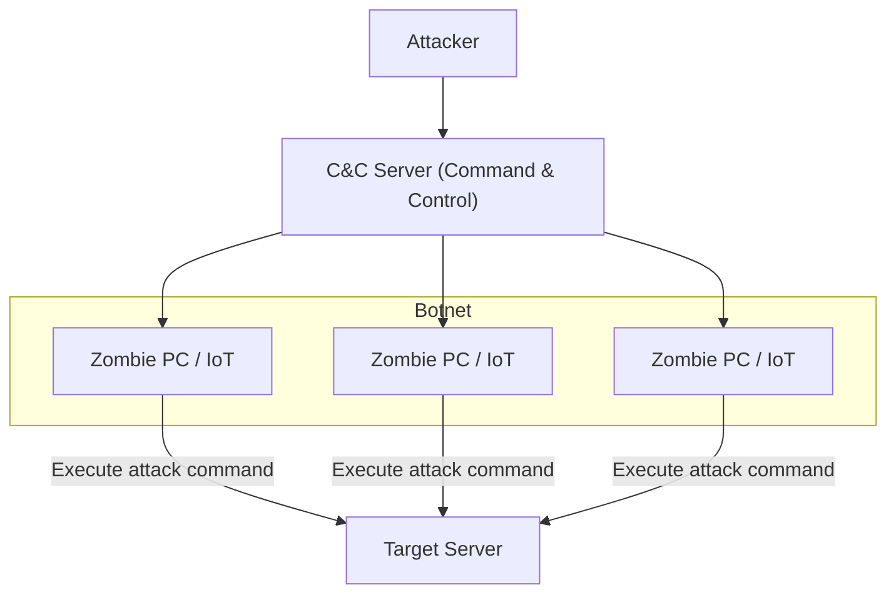

## I. Overview

**Definition**: An attack technique that mobilizes numerous distributed attack points ( **Botnet** ) to exhaust the resources of a target system or network, making normal service impossible.

**Features**:  
( **Availability Breach** ) Induces service response delays and system downtime, directly attacking availability ( **Availability** ), one of the three core elements of information security.  
( **Large-Scale Distribution** ) Leverages zombie **PCs** and **IoT** devices distributed worldwide, making defense by blocking a single attack source difficult.  
( **Attack Complexity** ) Evolves into multi-vector ( **Multi-vector** ) attacks that combine simple traffic flooding with application-vulnerability exploitation.

## II. Mechanism & Components

### Botnet-Based Attack Structure

### Major Classification by Attack Layer and Method

| Category | Attack Technique | Detailed Mechanism | Countermeasure |
|:---:|----------|--------------|-----------|
| **Bandwidth Exhaustion** | **UDP** / **ICMP Flood** | Sends a large volume of packets to occupy network link bandwidth | Increase link capacity, **ISP**-coordinated blocking |
| **Resource Exhaustion** | **TCP SYN Flood** | Exploits a weakness in the **3-way Handshake** process to exhaust server connection sessions | **SYN Cookie**, session threshold management |
| **Reflection / Amplification** | **DNS** / **NTP Reflection** | Routes attack traffic through vulnerable servers to amplify its size before sending | **Anycast**, request-packet filtering |
| **Application Layer** | **HTTP GET Flood** | Generates a large volume of seemingly normal **HTTP** requests to exhaust web server resources | **WAF**, threshold-based blocking, **CAPTCHA** |
| **Sophisticated Attack** | **Slowloris** | Keeps connections open extremely slowly to gradually occupy the server's threads | Strengthened timeout settings, use of a reverse proxy |

## III. Comparison & Application

| Mitigation Approach | Best Fit | Weakness |
|---|---|---|
| On-Prem Appliance (WAF, threshold blocking) | Application-layer floods, low-to-moderate volume | Link itself still saturates under large volumetric floods |
| Cloud Mitigation (AWS Shield, Cloudflare) | Large-scale volumetric and reflection attacks | Ongoing service cost, routes traffic through a third party |
| Anycast Routing | Geographically distributed attack sources | Doesn't stop application-layer floods on its own |
| BGP Flowspec (ISP-level) | Attacks that already exceed local link capacity | Requires upstream ISP cooperation and BGP-capable infrastructure |

Sizing the response to the attack class is the decision that actually matters — an on-prem WAF stops a Slowloris or HTTP GET flood cold but does nothing once a volumetric flood fills the upstream link, and no amount of local appliance tuning fixes a saturated pipe. Once attack volume can plausibly exceed your own link capacity, cloud scrubbing or ISP-level Flowspec isn't an upgrade, it's the only tier that can actually absorb the traffic before it reaches you.
