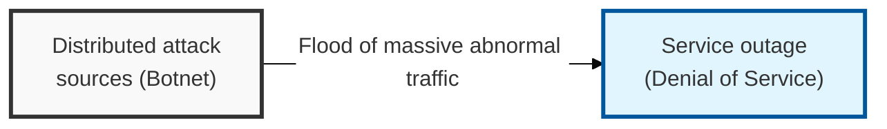
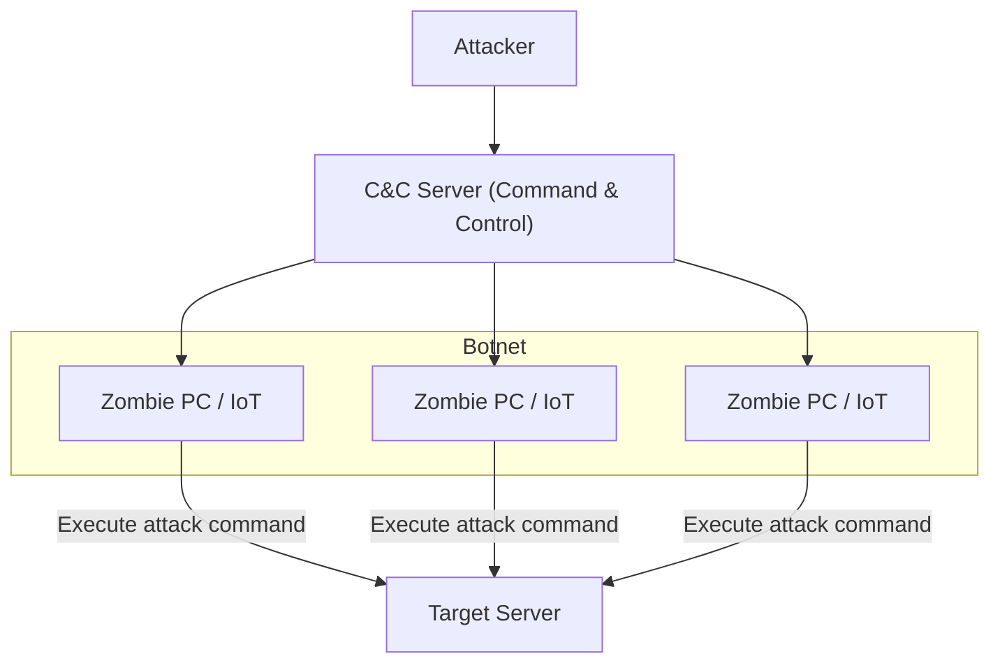

## I. Overview

**Definition**: An attack technique that mobilizes numerous distributed attack points ( **Botnet** ) to exhaust the resources of a target system or network, making normal service impossible.

**Features**:  
( **Availability Breach** ) Induces service response delays and system downtime, directly attacking availability ( **Availability** ), one of the three core elements of information security.  
( **Large-Scale Distribution** ) Leverages zombie **PCs** and **IoT** devices distributed worldwide, making defense by blocking a single attack source difficult.  
( **Attack Complexity** ) Evolves into multi-vector ( **Multi-vector** ) attacks that combine simple traffic flooding with application-vulnerability exploitation.

## II. Mechanism & Components

### Botnet-Based Attack Structure

### Major Classification by Attack Layer and Method

| Category | Attack Technique | Detailed Mechanism | Countermeasure |
|:---:|----------|--------------|-----------|
| **Bandwidth Exhaustion** | **UDP** / **ICMP Flood** | Sends a large volume of packets to occupy network link bandwidth | Increase link capacity, **ISP**-coordinated blocking |
| **Resource Exhaustion** | **TCP SYN Flood** | Exploits a weakness in the **3-way Handshake** process to exhaust server connection sessions | **SYN Cookie**, session threshold management |
| **Reflection / Amplification** | **DNS** / **NTP Reflection** | Routes attack traffic through vulnerable servers to amplify its size before sending | **Anycast**, request-packet filtering |
| **Application Layer** | **HTTP GET Flood** | Generates a large volume of seemingly normal **HTTP** requests to exhaust web server resources | **WAF**, threshold-based blocking, **CAPTCHA** |
| **Sophisticated Attack** | **Slowloris** | Keeps connections open extremely slowly to gradually occupy the server's threads | Strengthened timeout settings, use of a reverse proxy |

## III. Advanced Topics & Comparison

### Phased Defense Strategy (Defense in Depth)

- **Threshold-Based Blocking**: Monitors the number of packets or sessions occurring per unit of time and automatically blocks traffic that deviates from the normal range.
- **Deep Packet Inspection (DPI)**: Verifies compliance with normal protocol specifications and selectively blocks packets containing known attack patterns ( **Signature** ).
- **Clean Zone Service**: Proactively filters attack traffic within the **ISP** infrastructure so that only clean traffic enters the internal network.

### Infrastructure and Cloud-Based Countermeasures

| Countermeasure Area | Details | Security Effect |
|----------|----------|----------|
| **Cloud Mitigation** | Dedicated services such as **AWS Shield**, **Cloudflare** | Absorbs and distributes large-scale traffic via globally distributed edge nodes |
| **Anycast Routing** | Routes attack traffic to the geographically nearest node | Distributes traffic load that would otherwise concentrate on one server |
| **BGP Flowspec** | Defines attack traffic attributes along the routing path for immediate blocking | Enables rapid response at the network core layer |

> **Key Point**: Modern **DDoS** defense is not a matter of a single appliance — it requires an integrated response system combining the **ISP**, cloud security services, and dedicated defense equipment.
