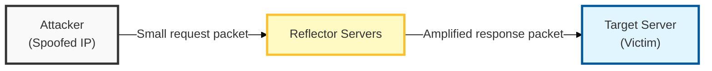
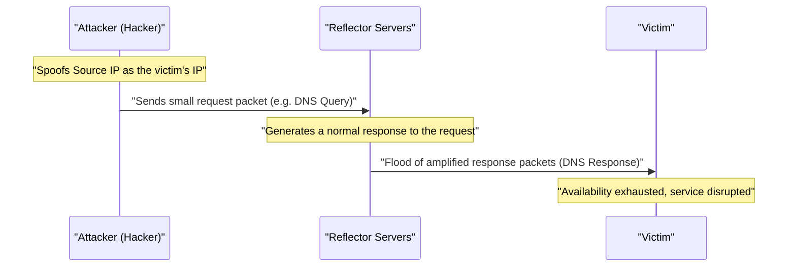

## I. Overview

**Definition**: An attack technique in which the attacker spoofs its own **IP** address as the victim's **IP** ( **Spoofing** ), sends requests to numerous reflector servers ( **Reflector** ), and has those servers concentrate amplified responses onto the victim, overwhelming it.

**Features**:  
( **Reflection and Amplification** ) Exploits characteristics of the **UDP** protocol to induce response packets tens to tens of thousands of times larger than the request — an amplification ( **Amplification** ) attack.  
( **Difficulty of Tracing** ) The attacker never sends packets directly but routes through servers providing legitimate services, making it extremely difficult to identify the true origin of the attack.  
( **Asymmetric Attack** ) With minimal resources (bandwidth), the attacker borrows the resources of reflector servers to inflict large-scale traffic damage on the victim.

## II. Mechanism & Components

### Reflection and Amplification Attack Process

### Major Reflection/Amplification Protocols and Amplification Factors

| Protocol | Primary Service | Amplification Factor (Max) | Detailed Mechanism |
|:---:|----------|:--------------:|--------------|
| **DNS** | Domain name resolution | About 50x | Returns a large-volume response to an `ANY` record request |
| **NTP** | Time synchronization | About 550x | Requests a list of recent connections via the `monlist` command |
| **SNMP** | Network management | About 6x | Bulk request for large volumes of device information |
| **SSDP** | Plug and play | About 30x | **UPnP** device discovery and information response |
| **Memcached** | Distributed memory cache | **About 50,000x** | Returns large volumes of cached data when the **UDP** port is exposed |

## III. Advanced Topics & Comparison

### DDoS vs. DRDoS Key Differences

| Comparison | General DDoS (Botnet-Based) | DRDoS (Reflector-Based) |
|:---:|------------------------|-----------------------|
| **Attack Origin** | Infected zombie **PCs** ( **Botnet** ) | Servers providing legitimate services ( **Reflector** ) |
| **Core Technique** | Mobilizing a large number of hosts | **IP Spoofing** and response amplification |
| **Securing Zombies** | Requires malware infection | Not required (scans for vulnerable servers) |
| **Concealment** | Moderate (bot IPs exposed) | Very high (legitimate server IPs exposed) |

### Technical and Administrative Countermeasures

- **Ingress/Egress Filtering (BCP38)**: Blocks packets whose source **IP** does not belong to the originating network's address range at network ingress/egress points, preventing spoofing.
- **DNS Sinkhole**: Redirects the **IP** for the targeted domain to a virtual site, routing attack traffic to a cleansing facility.
- **Threshold-Based Blocking**: Automatically blocks and monitors traffic when specific protocols ( **UDP 53**, **123**, etc.) surge above normal levels.
- **Reflector Server Management**: Closes unnecessary **UDP** services and applies the latest patches (e.g., disabling the **NTP monlist** feature).

> **Key Point**: Since **DRDoS** weaponizes legitimate servers, worldwide strengthening of security configurations ( **Anti-spoofing** ) and cooperative defense at the **ISP** layer are essential.
