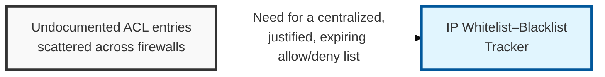
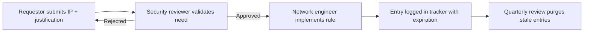

## I. Overview

**Definition**: An **IP** (Internet Protocol) Whitelist–Blacklist Tracker records every address or subnet explicitly permitted or denied at the firewall, WAF, or reverse proxy, along with who requested the entry, why, and when it expires.

**Features**:  
( **Ownership** ) Maintained by the network security engineering team, with entries requested by application owners and approved by a security reviewer.  
( **Justification Trail** ) Captures who requested each entry, why it exists, and when it expires.  
( **Prevents Silent Accumulation** ) Without it, allow and deny lists build up silently inside device configurations.  
( **Traceability** ) Stale entries would otherwise persist for years with no record of why a given IP has access.

## II. Structure & Process

| Field | Description |
|---|---|
| IP Address / CIDR | The address, range, or subnet being listed |
| List Type | **Whitelist** (allow) or **Blacklist** (deny) |
| Business Justification | Reason the entry exists, e.g. partner API access, known threat actor, vendor office |
| Requestor | Individual or team who requested the entry |
| Approver | Security reviewer who authorized the change |
| Enforcement Point | Device or service applying the rule, e.g. **firewall**, **WAF**, **cloud security group** |
| Date Added | When the entry took effect |
| Expiration / Review Date | Date the entry must be re-justified or removed |

Entries are requested on demand, approved before implementation, and swept quarterly so expired or unjustified rules are removed rather than accumulating indefinitely.

## III. Comparison & Application

| Approach | Best Fit | Weakness |
|---|---|---|
| IP Whitelist / Blacklist | Static partner links, legacy systems that can't carry identity context | Address changes silently break access; spoofable; no user-level granularity |
| Identity/Device-Based (Zero Trust) | Distributed workforce, SaaS, anything that can authenticate | Requires broader identity and device-posture tooling to be in place first |

Don't treat this as an either/or migration — most networks run both for years. The deciding factor per entry is whether the other end can authenticate at all: a partner's fixed egress IP for a legacy SFTP feed still belongs on this tracker, but any entry added purely because provisioning identity-based access felt like more work is a sign the org is defaulting to the weaker control out of convenience, not necessity.

Related: [Network Access Control Log](../network-access-control-log/), [Network Device Inventory](../network-device-inventory/)
