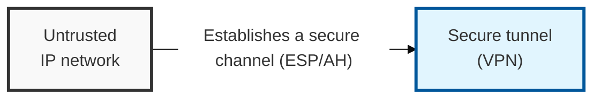
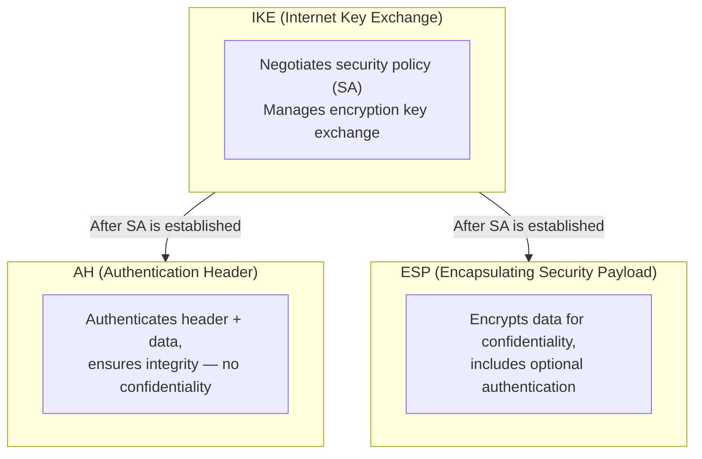
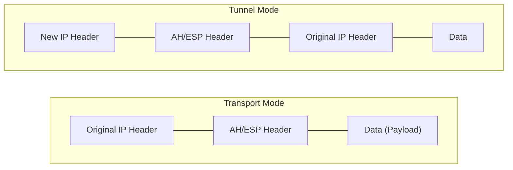

## I. Overview

**Definition**: A protocol suite that establishes a security channel at the network layer ( **L3** ) through encryption and authentication between communicating parties when transmitting data over an **IP** network.

**Features**:  
( **Confidentiality** ) Encrypts data via **ESP** ( **Encapsulating Security Payload** ).  
( **Integrity** ) Prevents tampering via **AH** ( **Authentication Header** ) and **ESP** authentication.  
( **Authentication** ) Confirms the identity of communicating entities and exchanges keys via the **IKE** ( **Internet Key Exchange** ) protocol.  
( **Availability** ) Uses sequence numbers ( **Sequence Number** ) to prevent replay attacks ( **Replay Attack** ).

## II. Mechanism & Components

### IPSec Protocol Stack Structure

| Protocol | Function | Confidentiality | Integrity | Authentication |
|--------|------|:-----:|:-----:|:----:|
| AH | Header + data authentication | ✕ | ✓ | ✓ |
| ESP | Data encryption + optional authentication | ✓ | ✓ | ✓ |
| IKE | SA negotiation and key exchange | — | — | ✓ |

### Transport Mode vs. Tunnel Mode

| Category | Transport Mode | Tunnel Mode |
|-----|--------------------------|----------------------|
| Protected Scope | The data (payload) portion of the IP packet | The entire IP packet (header + data) |
| Header Structure | Uses the original IP header as-is | Adds a **new IP header** |
| Primary Use | Host-to-host (end-to-end) communication | Site-to-site VPN |
| Characteristics | Lower overhead, but the original IP is exposed | Higher security, enables private IP communication |

## III. Comparison & Application

| Approach | Best Fit | Weakness |
|---|---|---|
| IPSec (Tunnel Mode) | Site-to-site links between fixed networks, vendor-agnostic interop | SPD/SAD policy management is complex and easy to misconfigure |
| WireGuard | Point-to-point tunnels needing minimal config and high throughput | Smaller ecosystem of enterprise policy/management tooling |
| TLS-based VPN / ZTNA | Remote users, per-application access from untrusted networks | Requires an identity and policy layer beyond the tunnel itself |

The decision rarely comes down to cryptographic strength — all three do encryption and authentication well enough. It comes down to what has to interoperate: IPSec remains the default for site-to-site links because every enterprise firewall and router speaks it, while WireGuard and TLS-based ZTNA win wherever the endpoint is a laptop on an untrusted network rather than another network device. A misconfigured SPD is the single most common cause of "the tunnel is up but nothing passes" — audit it before touching the crypto settings.
