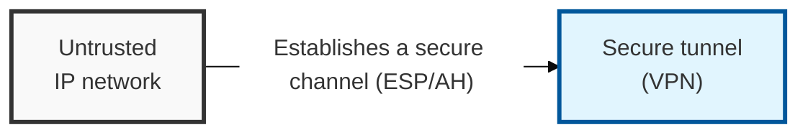
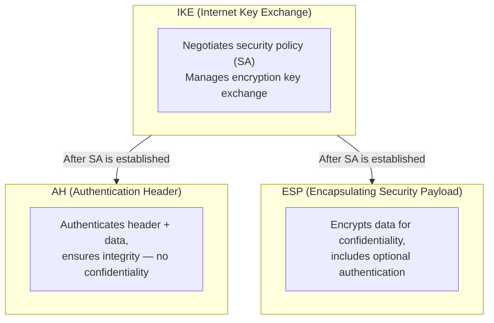
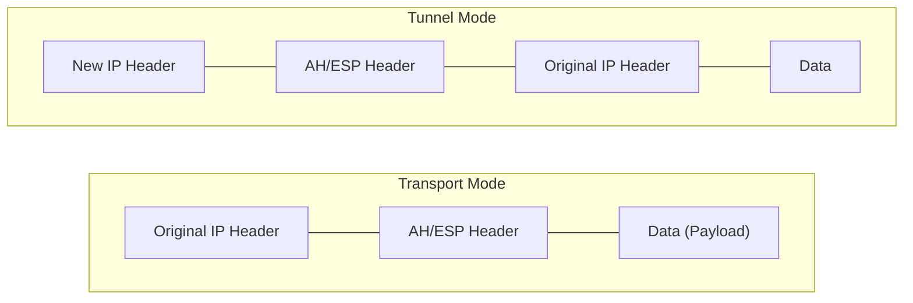
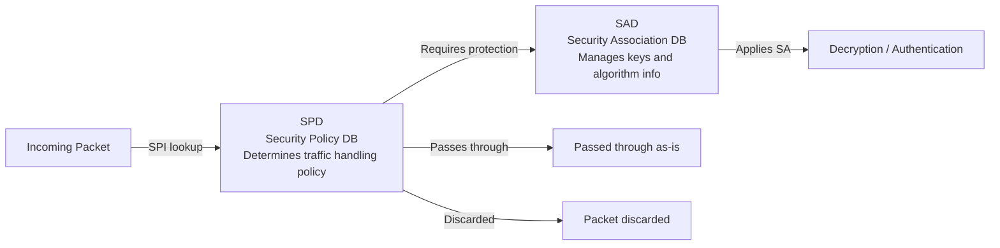

## I. Overview

**Definition**: A protocol suite that establishes a security channel at the network layer ( **L3** ) through encryption and authentication between communicating parties when transmitting data over an **IP** network.

**Features**:  
( **Confidentiality** ) Encrypts data via **ESP** ( **Encapsulating Security Payload** ).  
( **Integrity** ) Prevents tampering via **AH** ( **Authentication Header** ) and **ESP** authentication.  
( **Authentication** ) Confirms the identity of communicating entities and exchanges keys via the **IKE** ( **Internet Key Exchange** ) protocol.  
( **Availability** ) Uses sequence numbers ( **Sequence Number** ) to prevent replay attacks ( **Replay Attack** ).

## II. Mechanism & Components

### IPSec Protocol Stack Structure

| Protocol | Function | Confidentiality | Integrity | Authentication |
|--------|------|:-----:|:-----:|:----:|
| AH | Header + data authentication | ✕ | ✓ | ✓ |
| ESP | Data encryption + optional authentication | ✓ | ✓ | ✓ |
| IKE | SA negotiation and key exchange | — | — | ✓ |

### Transport Mode vs. Tunnel Mode

| Category | Transport Mode | Tunnel Mode |
|-----|--------------------------|----------------------|
| Protected Scope | The data (payload) portion of the IP packet | The entire IP packet (header + data) |
| Header Structure | Uses the original IP header as-is | Adds a **new IP header** |
| Primary Use | Host-to-host (end-to-end) communication | Site-to-site VPN |
| Characteristics | Lower overhead, but the original IP is exposed | Higher security, enables private IP communication |

## III. Advanced Topics & Comparison

### IPSec Security Policy Management: SPD and SAD

| Element | Detailed Description | Notes |
|-----|---------|------|
| SPD (Security Policy DB) | A policy database that decides which traffic to process for security | Determines protect / pass / discard |
| SAD (Security Association DB) | Manages the encryption keys and algorithm information for currently active SAs | Active security information |
| SPI (Index) | An index value that identifies which SA an incoming packet corresponds to | Included in the packet header |

> **Key Point**: **IPSec** operates at the network layer (L3), so it can apply security transparently without requiring changes to upper-layer applications, and it serves as the core underlying technology for VPN implementations.
