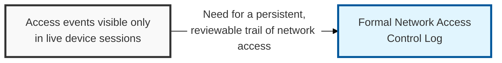
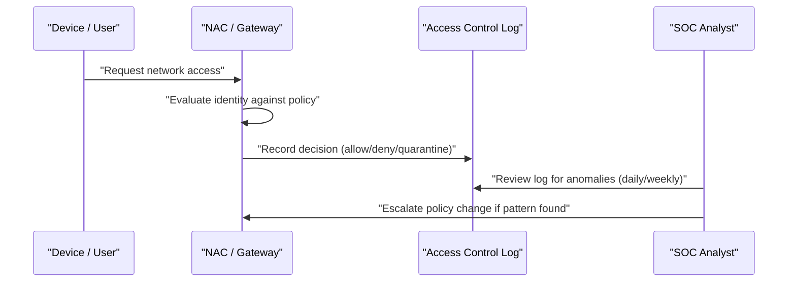

## I. Overview

**Definition**: A Network Access Control Log records connection events into network zones and segments and whether each event matched an authorized policy.

**Features**:  
( **Ownership** ) Maintained by the NOC for raw capture and reviewed by the SOC for anomaly detection.  
( **Event Coverage** ) Spans VPN logins, 802.1X port authentications, VLAN assignments, and remote access sessions.  
( **Investigative Trail** ) Without it, access decisions made only at the moment of connection leave no record for later investigation.  
( **Use Case** ) Supports investigating lateral movement, policy violations, and unauthorized devices after the fact.

## II. Structure & Process

| Field | Description |
|---|---|
| Timestamp | Date and time of the access event |
| Identity | User, device, or service account attempting access |
| Source Location | Originating IP, VLAN, or physical port |
| Target Zone / Segment | Network segment or resource the identity attempted to reach |
| Authentication Method | e.g. **802.1X**, **VPN certificate**, **MFA**, **SPA** (Single Packet Authorization) |
| Decision | Allowed, denied, or quarantined |
| Policy Reference | Access control policy or rule that produced the decision |
| Reviewed By | Analyst who signed off during periodic log review |

Log entries are generated automatically at each access attempt; the SOC reviews aggregated entries on a daily or weekly cadence and escalates recurring denials or unexpected access patterns.

## III. Expected Benefits & Implications

The value of this log isn't measured by how many entries it accumulates — it's measured by how fast an analyst can answer "was this device ever on our network, and what did it touch" during an incident. A log nobody has ever successfully queried under time pressure is functionally the same as no log at all.

| Benefit | Where It Shows Up |
|---|---|
| Faster lateral-movement investigation | Time-to-scope during incident response |
| Early misconfiguration/reconnaissance signal | Denied-access patterns reviewed before they escalate |
| Defensible access history | Audit and compliance evidence requests |

Prioritize retention length and query speed over field completeness — a log that's too slow to search during an active incident, or that's already rolled off retention by the time someone needs it, delivers none of the benefit above no matter how many fields it captures.

Related: [IP Whitelist–Blacklist Tracker](../ip-whitelist-blacklist-tracker/), [Network Traffic Monitoring Dashboard](../network-traffic-monitoring-dashboard/)
