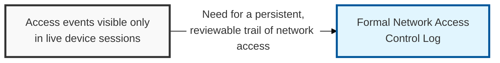
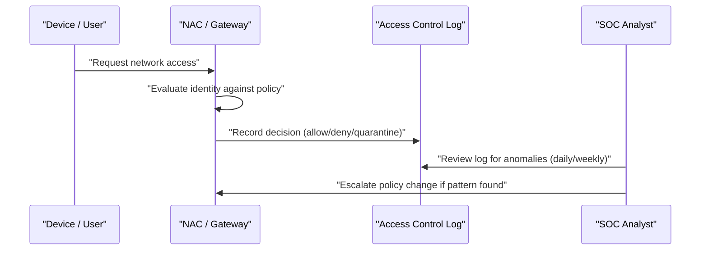

## I. Overview

**Definition**: A Network Access Control Log records connection events into network zones and segments and whether each event matched an authorized policy.

**Features**:  
( **Ownership** ) Maintained by the NOC for raw capture and reviewed by the SOC for anomaly detection.  
( **Event Coverage** ) Spans VPN logins, 802.1X port authentications, VLAN assignments, and remote access sessions.  
( **Investigative Trail** ) Without it, access decisions made only at the moment of connection leave no record for later investigation.  
( **Use Case** ) Supports investigating lateral movement, policy violations, and unauthorized devices after the fact.

## II. Structure & Process

| Field | Description |
|---|---|
| Timestamp | Date and time of the access event |
| Identity | User, device, or service account attempting access |
| Source Location | Originating IP, VLAN, or physical port |
| Target Zone / Segment | Network segment or resource the identity attempted to reach |
| Authentication Method | e.g. **802.1X**, **VPN certificate**, **MFA**, **SPA** (Single Packet Authorization) |
| Decision | Allowed, denied, or quarantined |
| Policy Reference | Access control policy or rule that produced the decision |
| Reviewed By | Analyst who signed off during periodic log review |

Log entries are generated automatically at each access attempt; the SOC reviews aggregated entries on a daily or weekly cadence and escalates recurring denials or unexpected access patterns.

## III. Best Practices & Comparison

| Document | Primary Purpose | Update Cadence | Owner |
|---|---|---|---|
| Network Access Control Log | Chronological record of access attempts and decisions | Continuous (event-driven) | NOC / SOC |
| [IP Whitelist–Blacklist Tracker](../ip-whitelist-blacklist-tracker/) | Defines which addresses are pre-authorized or blocked | On request + quarterly review | Network Security Engineering |
| SDP (Software Defined Perimeter) | Architecture that authenticates before any connection is visible | As-needed on strategy revision | Network Security Engineering |

- Log both successful and denied access attempts — denials often reveal reconnaissance or misconfiguration first.
- Retain logs long enough to support incident investigations per the organization's retention policy.
- Correlate access logs with identity and endpoint posture data, not IP address alone.
- Automate alerting on access from unexpected locations, times, or previously unseen devices.

Related: [IP Whitelist–Blacklist Tracker](../ip-whitelist-blacklist-tracker/), [Network Traffic Monitoring Dashboard](../network-traffic-monitoring-dashboard/)
