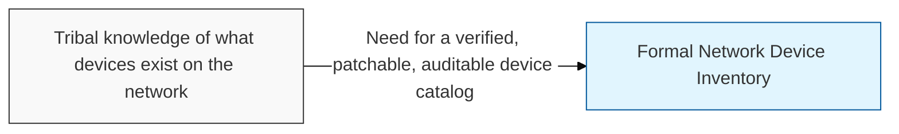
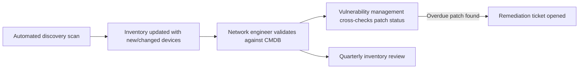

## I. Overview

A Network Device Inventory is the authoritative list of every physical and virtual network device — routers, switches, firewalls, load balancers, wireless access points, VPN concentrators — with its location, firmware version, and configuration baseline. The network security engineering team owns and maintains it, typically backed by a discovery or CMDB (Configuration Management Database) tool. Security programs depend on it because unpatched or unknown ("shadow") devices are a leading source of breaches, and neither vulnerability management nor incident response can function without knowing what is actually on the network.

## II. Structure & Process

| Field | Description |
|---|---|
| Device Name / ID | Unique identifier or hostname |
| Device Type | e.g. **router**, **switch**, **firewall**, **wireless AP**, **load balancer** |
| Location | Physical site or logical network zone |
| Management IP | Address used for administrative access |
| Firmware / OS Version | Current software version running on the device |
| Patch Status | Up to date, pending, or overdue against the patch policy |
| Configuration Baseline | Reference to the approved configuration template applied |
| Owner / Point of Contact | Team responsible for maintaining the device |

Automated discovery scans populate and refresh the inventory continuously; a network engineer validates changes, and the full inventory is reconciled against the CMDB quarterly.

## III. Best Practices & Comparison

| Document | Primary Purpose | Update Cadence | Owner |
|---|---|---|---|
| Network Device Inventory | Catalog every device, its version, and patch state | Continuous (automated) + quarterly review | Network Security Engineering |
| [Network Security Risk Mitigation](../network-security-risk-mitigation/) | Tracks risks and remediation across the network, device inventory included | Quarterly | CISO / Network Security |
| NIST SP 800-41 (Firewall Guidelines) | Baseline hardening standard applied to firewall devices | As-needed on standard revision | Network Security Engineering |

- Run automated discovery rather than relying on manual spreadsheets to catch shadow devices.
- Flag any device without a known owner for immediate investigation.
- Tie patch status directly into the vulnerability management workflow, not a separate tracker.
- Reconcile the inventory against the CMDB and asset management system on a fixed cadence.
- Retire and remove decommissioned devices from the inventory promptly to avoid false coverage assumptions.

Related: [Network Security Risk Mitigation](../network-security-risk-mitigation/), [Network Traffic Monitoring Dashboard](../network-traffic-monitoring-dashboard/)
