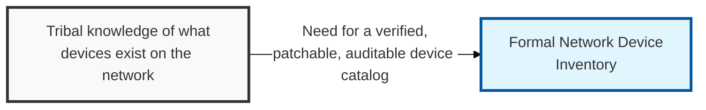
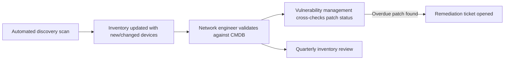

## I. Overview

**Definition**: A Network Device Inventory is the authoritative list of every physical and virtual network device, with its location, firmware version, and configuration baseline.

**Features**:  
( **Ownership** ) Owned and maintained by the network security engineering team, typically backed by a discovery or CMDB (Configuration Management Database) tool.  
( **Device Coverage** ) Spans routers, switches, firewalls, load balancers, wireless access points, and VPN concentrators.  
( **Shadow Device Risk** ) Unpatched or unknown ("shadow") devices are a leading source of breaches when no inventory exists.  
( **Dependency** ) Neither vulnerability management nor incident response can function without knowing what is actually on the network.

## II. Structure & Process

| Field | Description |
|---|---|
| Device Name / ID | Unique identifier or hostname |
| Device Type | e.g. **router**, **switch**, **firewall**, **wireless AP**, **load balancer** |
| Location | Physical site or logical network zone |
| Management IP | Address used for administrative access |
| Firmware / OS Version | Current software version running on the device |
| Patch Status | Up to date, pending, or overdue against the patch policy |
| Configuration Baseline | Reference to the approved configuration template applied |
| Owner / Point of Contact | Team responsible for maintaining the device |

Automated discovery scans populate and refresh the inventory continuously; a network engineer validates changes, and the full inventory is reconciled against the CMDB quarterly.

## III. Vulnerabilities & Security Measures

| Risk | Root Cause | Security Measure |
|---|---|---|
| Shadow devices | Deployed outside procurement/change process, never entered manually | Automated discovery scan, not spreadsheet-based tracking |
| Unowned devices | Team turnover, ownership never reassigned | Flag ownerless entries for immediate investigation |
| Overdue firmware | Patch status tracked separately from vulnerability management | Tie patch status directly into the vulnerability management workflow |
| Stale inventory | Decommissioned devices never removed | Retire entries promptly to avoid false coverage assumptions |

The single most dangerous entry in this inventory is the device nobody remembers approving — an unowned access point or forgotten VPN concentrator is a standing foothold for an attacker, and it will never show up on a vulnerability scan that only checks devices someone already knows to point it at. Automated discovery isn't a nice-to-have here; it's the only mechanism that reliably surfaces what manual tracking always misses.

Related: [Network Security Risk Mitigation](../network-security-risk-mitigation/), [Network Traffic Monitoring Dashboard](../network-traffic-monitoring-dashboard/)
