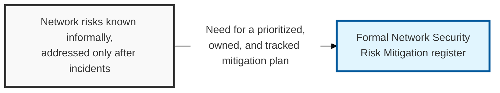
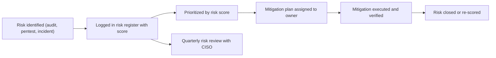

## I. Overview

**Definition**: A Network Security Risk Mitigation register catalogs identified network risks and pairs each with a likelihood, impact, and a concrete mitigation plan with an owner and target date.

**Features**:  
( **Ownership** ) Maintained by the network security engineering team and reviewed by the CISO's office as part of the broader enterprise risk program.  
( **Risk Coverage** ) Spans unsegmented zones, legacy protocols, single points of failure, and unmanaged remote access.  
( **Proactive Prioritization** ) Without it, network risk lives in engineers' heads and is ranked only after an incident forces the issue.  
( **Accountability** ) Every risk carries an assigned owner and target date rather than staying informally tracked.

## II. Structure & Process

| Field | Description |
|---|---|
| Risk ID | Unique identifier for tracking |
| Risk Description | The specific weakness, e.g. flat network with no segmentation between zones |
| Likelihood | Probability the risk is exploited, e.g. **low / medium / high** |
| Impact | Potential business or operational consequence if realized |
| Risk Score | Combined likelihood x impact rating used for prioritization |
| Mitigation Plan | Proposed control or architectural change to reduce the risk |
| Owner | Person or team accountable for executing the mitigation |
| Target Date / Status | Planned completion date and current progress |

Risks are logged as they are identified through audits, penetration tests, or incidents, prioritized by score, and reviewed quarterly with the CISO's office to track mitigation progress and re-prioritize as the environment changes.

## III. Best Practices & Comparison

| Document | Primary Purpose | Update Cadence | Owner |
|---|---|---|---|
| Network Security Risk Mitigation | Prioritize and track remediation of identified network risks | Continuous intake + quarterly review | Network Security Engineering / CISO |
| [DDoS Attack Mitigation Plan Tracker](../ddos-attack-mitigation-plan-tracker/) | Focused readiness plan for one risk category (availability attacks) | Quarterly + post-incident | Network Security Engineering |
| Zero Trust Architecture (NIST SP 800-207) | Architectural strategy that reduces several network risk categories at once | As-needed on strategy revision | CISO / Network Security |

- Score risks consistently using a defined likelihood/impact matrix, not ad hoc judgment.
- Assign a single accountable owner and target date to every open risk — no unowned entries.
- Re-score risks after mitigation to confirm the control actually reduced exposure.
- Feed findings from penetration tests and audits directly into the register rather than tracking them separately.
- Escalate high-score risks with no assigned mitigation plan to the CISO immediately.

Related: [DDoS Attack Mitigation Plan Tracker](../ddos-attack-mitigation-plan-tracker/), [Network Device Inventory](../network-device-inventory/)
