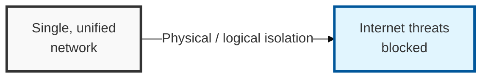

## I. Overview

**Definition**: A collective term for network separation, which isolates the internal business network from the external internet to block outside attacks, and network integration, which ensures the safe movement of data between the separated networks.

**Features**:  
( **APT Response** ) Protects internal network assets from Advanced Persistent Threats ( **APT** ) and blocks the spread of an attack.  
( **Data Leak Prevention** ) Isolates the outbound path for sensitive information and personal data at the source.  
( **Compliance** ) Satisfies requirements of the Network Act, the Personal Information Protection Act, and **ISMS-P** certification.

## II. Mechanism & Components

### Physical vs. Logical Network Separation

| Category | Physical Separation | Logical Separation |
|------|-------------------------|------------------------|
| Implementation | Uses two physical PCs (physical isolation) | Uses server/desktop virtualization ( **VDI** ) |
| Security Level | Highest (physically separate circuits) | Relatively lower (virtualization vulnerabilities exist) |
| Build Cost | High (hardware procurement and circuit installation) | Moderate (centered on software and server infrastructure) |
| Convenience | Low (space required, must switch between PCs) | High (multitasking possible on a single device) |
| Primary Use | Defense, critical national facilities, core networks | General enterprises, general financial-sector operations |

### Data Transfer Systems for Safe Data Exchange (Network Integration)

**Concept**: A bridge role within an air-gapped environment that minimizes the points of contact between networks while allowing only approved data to pass through.

**Key Technologies**:
- **Storage-Based**: Delivers data and performs security scanning through an intermediate shared storage device (NAS/SAN).
- **Socket-Based**: Transfers data between memory using a dedicated communication protocol.
- **IEEE 1394 / USB**: Direct connection between networks via serial bus (mainly used recently in virtualized approaches).

## III. Advanced Topics & Comparison

Even in a network-separated environment, bypass paths can emerge or configuration errors can cause the two networks to mix — a "network commingling" issue that becomes security's Achilles heel.

| Issue Type | Cause | Countermeasure and Security Reinforcement |
|----------|---------|---------------------|
| Unauthorized Bypass | Tethering, use of rogue wireless APs | Introduce media control ( **DLP** ) and unauthorized wireless device detection ( **WIPS** ) |
| Data Transfer Misuse | Bypassing security approval, unapproved large-volume transfers | Detailed logging ( **Audit Trail** ) and integration with personal-data detection solutions |
| Convenience-Driven Exceptions | Allowing remote access for maintenance, etc. | Adopt **Zero Trust** ( **ZTNA** ), ensure per-session visibility |
