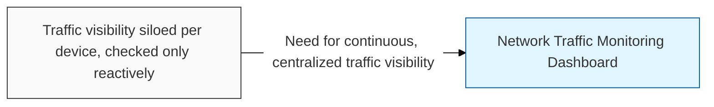
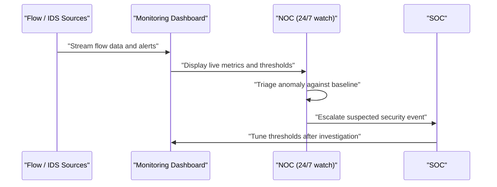

## I. Overview

A Network Traffic Monitoring Dashboard consolidates flow data, packet captures, and IDS/IPS alerts into a single operational view of what is moving across the network, at what volume, and whether any of it deviates from baseline. It is built and maintained by the network security engineering team and used day to day by the SOC and NOC for detection and troubleshooting. Without centralized traffic visibility, threats that manifest as subtle traffic anomalies — reconnaissance scans, slow data exfiltration, protocol-layer floods — go unnoticed until they escalate into an outage or breach.

## II. Structure & Process

| Field | Description |
|---|---|
| Data Source | Flow export, mirrored traffic, or IDS/IPS feed contributing to the view, e.g. **NetFlow**, **sFlow**, **packet capture** |
| Metric / Widget | Displayed measure, e.g. throughput by segment, top talkers, protocol distribution |
| Baseline Range | Expected normal value or pattern for the metric |
| Alert Threshold | Value that triggers an anomaly alert, e.g. sudden spike in outbound volume |
| Alert Severity | Priority assigned to threshold breaches, e.g. **low / medium / critical** |
| Escalation Path | Team or on-call rotation notified when a critical alert fires |
| Retention Window | How long historical traffic data is kept for investigation |
| Dashboard Owner | Team responsible for maintaining widgets and thresholds |

The dashboard ingests data continuously; the NOC watches it around the clock for operational anomalies and escalates suspected security events to the SOC, which periodically tunes alert thresholds based on investigation outcomes.

## III. Best Practices & Comparison

| Document | Primary Purpose | Update Cadence | Owner |
|---|---|---|---|
| Network Traffic Monitoring Dashboard | Continuous visibility into traffic volume, mix, and anomalies | Continuous (real-time) | Network Security Engineering / NOC / SOC |
| [Network Access Control Log](../network-access-control-log/) | Records discrete access decisions rather than ongoing traffic patterns | Continuous (event-driven) | NOC / SOC |
| SASE (Secure Access Service Edge) | Cloud-delivered architecture combining network and security monitoring at the edge | As-needed on strategy revision | Network Security Engineering |

- Establish traffic baselines per segment before setting alert thresholds, to reduce false positives.
- Correlate flow anomalies with IDS/IPS and access logs rather than treating any single feed as sufficient.
- Retain historical traffic data long enough to support post-incident forensic review.
- Review and tune alert thresholds regularly as network usage patterns evolve.
- Assign clear on-call ownership so critical alerts are never left unacknowledged.

Related: [Network Access Control Log](../network-access-control-log/), [DDoS Attack Mitigation Plan Tracker](../ddos-attack-mitigation-plan-tracker/)
