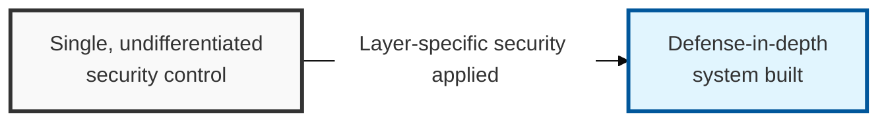

## I. Overview

**Definition**: A framework that analyzes the security threats specific to each of the seven network layers defined by the International Organization for Standardization ( **ISO** ) and applies matching security technologies and solutions to counter them.

**Features**:  
( **Layered Security** ) Implements a multi-layer defense system in which a threat is still blocked at another layer even if a specific layer is compromised.  
( **Visibility** ) Provides fine-grained control over network traffic through protocol analysis at each layer.  
( **Accountability** ) Enables precise identification of where a fault or security incident occurred, allowing for rapid response.

## II. Mechanism & Components

### OSI 7-Layer Security Architecture

- **Lower Layers** (Physical / Data Link): Handle physical connectivity and security between adjacent nodes.
- **Upper Layers** (Transport / Application): Control end-to-end encryption and data visibility.

### Security Activities and Core Protocols by Layer

| Layer | Primary Security Threat | Countermeasure Technology/Protocol | Security Equipment / Solution |
|:---:|--------------|--------------------|-----------------|
| **7. Application** | SQL Injection, XSS, HTTP Flooding | S-HTTP, PGP / S-MIME, DNSSEC | WAF, Anti-Spam |
| **6. Presentation** | Data tampering, decryption attacks | Format verification, encryption / compression | - |
| **5. Session** | Session Hijacking | SSH, RPC security | - |
| **4. Transport** | Port Scanning, SYN Flooding | SSL / TLS, WTLS | FW, Load Balancer |
| **3. Network** | IP Spoofing, ICMP Flooding | IPSec (AH, ESP), VPN | Router ACL, IPS |
| **2. Data Link** | MAC Flooding, ARP Spoofing | 802.1x, MAC filtering | L2 / L3 security switch |
| **1. Physical** | Eavesdropping (Tapping), physical destruction | Physical shielding, port locking | CCTV, fingerprint recognition |

## III. Advanced Topics & Comparison

### Upper-Layer (L4-L7) Focused Security Strengthening

Where security once centered on simple blocking at L3/L4, it is now evolving toward intelligent, **DPI** (Deep Packet Inspection)-based security that analyzes application payloads.

### Securing Visibility into Encrypted Traffic

With the surge in **SSL** / **TLS** usage, deploying **SSL visibility solutions** (SSL Inspection) alongside existing defenses is essential to detect malware hidden inside encrypted traffic.

### Integration with Zero Trust

Beyond individual layer-by-layer responses, there is a growing need to move toward an integrated security architecture that applies "**never trust, always verify**" to every access request across all layers.
