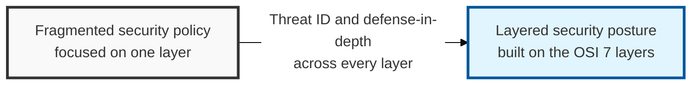
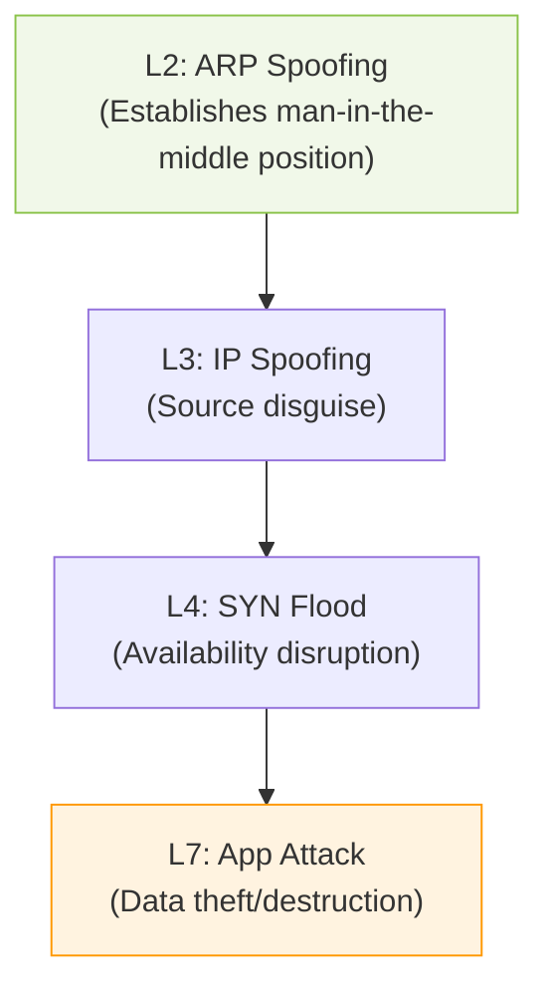

## I. Overview

**Definition**: The set of security vulnerabilities unique to each layer of the **OSI 7 Layer** standard model — which divides the network communication process into seven layers — and the technical defense systems that counter them.

**Features**:  
( **Systematic Threat Identification** ) Clearly identifies the communication protocol location targeted by attackers, enabling a precise response strategy.  
( **Defense in Depth** ) Builds staged defenses from the lower physical layer up to the upper application layer, eliminating a single point of failure ( **SPOF** ).  
( **Accountability** ) Quickly pinpoints the layer at which a security incident occurred, shortening incident response ( **IR** ) time.  
( **Optimized Visibility** ) Improves detection accuracy for anomalous attack patterns by analyzing the traffic characteristics of each layer.

## II. Mechanism & Components

### Mapping of Representative Attacks and Security Solutions by Layer

| Layer | Primary Security Threats | Countermeasure Technology/Solution |
|:---:|------------------------|-----------------------------|
| **L7. Application** | **HTTP Flood**, **SQL Injection**, **XSS** | **WAF**, **IPS**, secure coding, **API Gateway** |
| **L6. Presentation** | Decryption bypass, format tampering attacks | **SSL/TLS** encryption, data integrity verification |
| **L5. Session** | **Session Hijacking**, **RPC** attacks | Strong authentication, session timeout, **SSH** |
| **L4. Transport** | **TCP SYN Flood**, **UDP Flood**, port scanning | Firewall ( **ACL** ), **IDS/IPS**, kernel parameter tuning |
| **L3. Network** | **IP Spoofing**, **ICMP Flood**, **DDoS** | **IPsec**, router filtering, **Bogon** filtering |
| **L2. Data Link** | **ARP Spoofing**, **MAC Flooding**, **VLAN Hop** | **Port Security**, **DHCP Snooping**, **DAI** |
| **L1. Physical** | Cable eavesdropping ( **Tapping** ), equipment destruction, power cutoff | Physical access control, closed-circuit TV ( **CCTV** ), shielded cabling |

### Cross-Layer Attack Chain Scenario

## III. Advanced Topics & Comparison

### Lower-Layer (L1-L3) vs. Upper-Layer (L4-L7) Security

| Comparison | Lower-Layer Security (L1-L3) | Upper-Layer Security (L4-L7) |
|:---:|----------------------|----------------------|
| **Primary Focus** | Packet transmission, path control, physical connectivity | Data processing, service logic, user authentication |
| **Security Goal** | Availability and integrity of network infrastructure | Data confidentiality and protection of business logic |
| **Unit of Analysis** | Packet headers, **MAC/IP** addresses | Payload, message body, session |
| **Primary Equipment** | Router, L3 switch, **VPN** | **WAF**, next-generation firewall ( **NGFW** ), **IPS** |

### Practical Recommendations for Security Maturity

- **Integrated Monitoring Across All Layers**: Use **SIEM** or **SOAR** to correlate logs generated at each layer, detecting composite attacks.
- **Apply the Zero Trust Model**: Regardless of layer, apply micro-segmentation ( **Micro-segmentation** ) under the principle of "never trust, always verify."
- **Ensure Encrypted Visibility**: Consider adopting **SSL Inspection** technology to detect malicious code hidden within **L6/L7**-level encrypted traffic.

> **Key Point**: Since modern attacks are not confined to a single layer but evolve across all layers, building a defense-in-depth system spanning the entire **OSI 7-layer** model is fundamental to achieving cyber resilience ( **Resilience** ).
