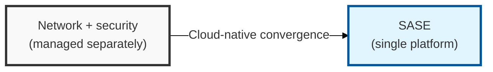
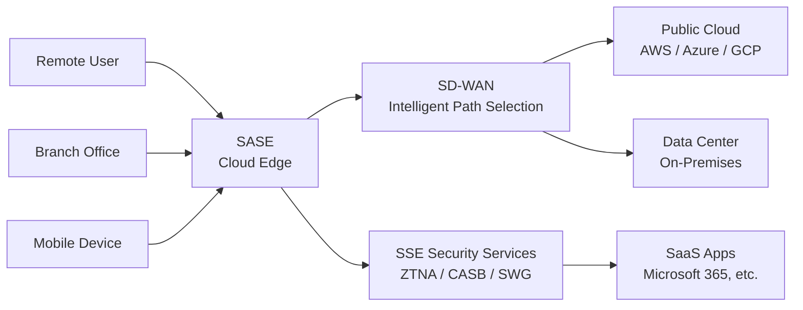

## I. Overview

**Definition**: A cloud-native architecture that delivers networking functions such as **SD-WAN** together with security services such as next-generation firewall, **CASB**, and **ZTNA** from a single cloud platform.

**Features**:  
( **Perimeter Collapse** ) The spread of cloud adoption and remote work has exposed the limits of the traditional perimeter-based security model.  
( **Network Bottlenecks** ) Backhauling traffic through the data center increases latency and degrades performance.  
( **Management Complexity** ) Fragmented, individual security solutions make unified policy management and visibility difficult.

## II. Mechanism & Components

### SASE Components and Technology Elements

> **Key Point**: The combination of networking technology that optimizes network paths with security technology that protects data and access.

### Key Components in Detail

| Category | Core Technology | Detailed Description |
|------|-------------|---------|
| Network (SD-WAN) | Software-Defined Wide Area Network | Intelligent, application-level path selection and ensured traffic availability |
| Security (SSE) | ZTNA | Zero-trust-based access control |
| Security (SSE) | CASB | Cloud app visibility and control |
| Security (SSE) | SWG | Secure web access and malware blocking |

## III. Outlook & Future Direction

| Approach | Maturity | Direction |
|---|---|---|
| Hub-and-Spoke (data-center backhaul) | Legacy | Being displaced for remote and branch traffic |
| SASE (cloud-native, converged) | Mainstream for new deployments | Default architecture for distributed workforces |

Expect SASE to finish absorbing the point solutions it currently sits alongside — CASB, SWG, and ZTNA are converging into a single policy plane not because bundling is fashionable, but because fragmented tools with fragmented policy are the actual root cause of the visibility gaps SASE was built to close. The organizations still backhauling remote traffic through a data center for inspection are paying a latency tax with no corresponding security benefit once an equivalent cloud-edge control exists.
