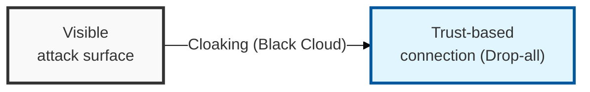
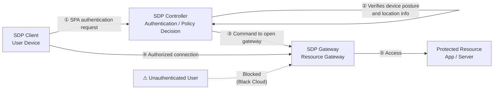

## I. Overview

**Definition**: A software-defined security architecture that cloaks infrastructure from the outside world ( **Black Cloud** ) until device authentication and user trust have been verified.

**Features**:  
( **Trust-Based** ) A core technology for implementing **Zero Trust**, applying an authenticate-first, connect-second mechanism.  
( **Concealment** ) Implements a "**Black Cloud**" that exposes no resources to unauthenticated users.  
( **Minimized Attack Surface** ) Blocks unauthenticated traffic at the source, defending against scanning and distributed denial-of-service ( **DDoS** ) attacks.

## II. Mechanism & Components

### SDP Logical Architecture

> **Key Point**: A structure in which authentication is completed in the control plane before the data plane's pathway is opened.

### Key Components and Security Technologies

| Component | Primary Role | Core Security Technology |
|----------|----------|--------------|
| SDP Controller | Authentication and policy decision | **SPA** (Single Packet Authorization): authentication attempted with a single packet |
| SDP Gateway | Resource access gateway | Black Cloud: blocks scanning by unauthenticated users (concealment) |
| SDP Client | User device software | Transmits device posture and location information |

## III. Outlook & Future Direction

| Approach | Maturity | Direction |
|---|---|---|
| Perimeter VPN | Legacy | Being displaced for remote access |
| SDP / ZTNA | Mainstream | Default for new remote-access deployments |

Expect SDP to finish displacing traditional VPN for remote access the way SSL/TLS displaced plaintext HTTP — the pressure isn't purely security, it's that SDP's authenticate-before-connect model maps far more cleanly onto a workforce split across SaaS, cloud, and on-prem than a VPN's all-or-nothing network-level tunnel ever could. The practical tell is scope: a VPN grants network access and trusts firewall rules to restrict it after the fact, while SDP grants access to one resource at a time and never exposes the rest — that difference in default posture is why SDP keeps winning new deployments even where VPN infrastructure is already sunk cost.
