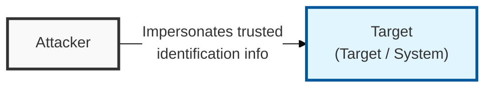
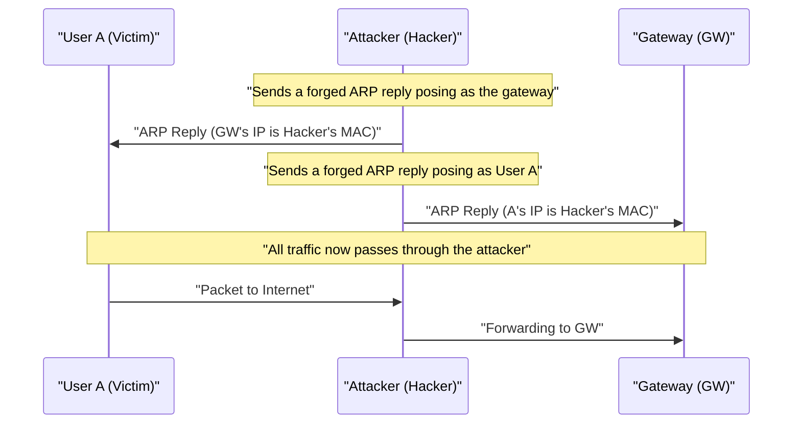

## I. Overview

**Definition**: An attack technique that forges network identification information such as **IP** addresses, **MAC** addresses, and **DNS** names to masquerade as an authorized user, gaining system access or intercepting data.

**Features**:  
( **Exploiting Trust Relationships** ) Exploits the trust relationship ( **Trust Relationship** ) between systems to bypass authentication procedures or hijack privileges.  
( **Basis for Man-in-the-Middle Attacks** ) Redirects the flow of data packets to the attacker, serving as the core mechanism for eavesdropping ( **Sniffing** ) and tampering in man-in-the-middle attacks ( **MITM** ).  
( **Occurs Across Multiple Layers** ) Occurs at every layer, from the data link layer ( **ARP** ) to the network layer ( **IP** ) to the application layer ( **DNS** / **Email** ).

## II. Mechanism & Components

### ARP Spoofing Mechanism (L2 Layer)

### Detailed Comparison of Major Spoofing Types

| Type | Forged Element | Attack Purpose | Core Mechanism |
|:---:|----------|----------|--------------|
| **IP Spoofing** | Source **IP** address | Filter evasion, hiding the origin of a **DDoS** attack | Tampering with the **Source IP** in the **IP** header |
| **ARP Spoofing** | **MAC** address | Eavesdropping on data within the local network ( **Sniffing** ) | Continuously sending forged **ARP Reply** packets |
| **DNS Spoofing** | **DNS** query response | Pharming ( **Pharming** ), redirection to phishing sites | Poisoning the **DNS** cache or pre-empting the legitimate response |
| **Email Spoofing** | Sender address | Social engineering attacks, spam/malware distribution | Forging sender information in the **SMTP** protocol |

## III. Advanced Topics & Comparison

### Technical Defenses (Network Security)

- **Static ARP/MAC Configuration**: Manually pinning the **ARP** table between critical servers and the gateway so that forged **ARP** packets are ignored.
- **Ingress/Egress Filtering**: Validating the legitimacy of source **IPs** at the network boundary to block inbound and outbound spoofed packets.
- **Strong Authentication**: Moving away from simple **IP**-address-based trust relationships toward encryption-based authentication such as **SSL** / **TLS** or **IPSec**.

### Infrastructure and Protocol Security Countermeasures

| Countermeasure Area | Details | Security Effect |
|----------|----------|----------|
| **DNS Security** | Adopt **DNSSEC** ( **DNS Security Extensions** ) | Verifies the integrity and legitimacy of **DNS** responses via digital signatures |
| **Email Security** | Configure **SPF** / **DKIM** / **DMARC** | Confirms sending-domain legitimacy to block forged mail |
| **L2 Security** | **Port Security** / **DAI** ( **Dynamic ARP Inspection** ) | Blocks invalid **MAC** / **ARP** at the switch port level |

> **Key Point**: Since **Spoofing** threatens confidentiality and integrity as well as availability, encrypted authentication of identification information and filtering at every network layer must be applied together.
