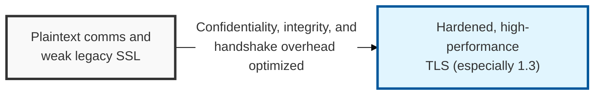
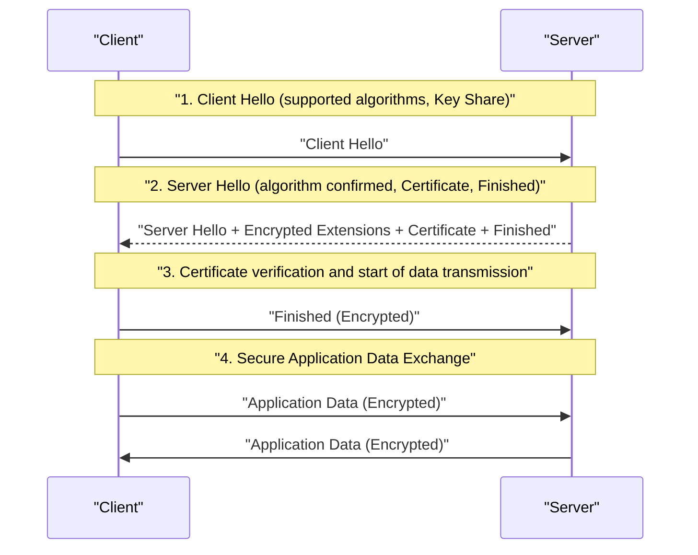

## I. Overview

**Definition**: A transport-layer security protocol ( **RFC 8446** ) that establishes an encrypted channel between a client and a server to guarantee the confidentiality, integrity, and authentication of data in internet communications.

**Features**:  
( **Hybrid Cryptosystem** ) Uses public-key cryptography ( **Asymmetric** ) to safely exchange a symmetric key, then transmits the actual data using fast symmetric-key encryption ( **Symmetric** ).  
( **Integrity Assurance** ) Uses a message authentication code ( **MAC** ) or **HMAC** to verify in real time whether data has been tampered with in transit.  
( **Strong Authentication** ) Uses digital certificates ( **X.509** ) and the **PKI** system to verify the identity of the communicating party and prevent man-in-the-middle attacks ( **MITM** ).  
( **Performance Optimization** ) The latest **TLS 1.3** shortens the handshake ( **1-RTT**, **0-RTT** ), achieving both security and speed.

## II. Mechanism & Components

### TLS 1.3 Handshake Flow (1-RTT)

### The Four Sub-Protocols That Make Up TLS

| Protocol | Detailed Description | Primary Role |
|:---:|----------|----------|
| **Handshake** | Negotiates the encryption algorithm ( **Cipher Suite** ) and generates the session key | Mutual authentication and agreement on security parameters |
| **Change Cipher Spec** | Notifies that subsequent messages will be sent using the negotiated cipher spec | Notification of the switch to encrypted mode |
| **Alert** | Communicates errors or risk conditions that occur during communication | Error handling and session termination control |
| **Record** | The basic unit that fragments, compresses, and encrypts actual data for transmission | Data encapsulation and integrity protection |

## III. Advanced Topics & Comparison

### TLS 1.2 vs. TLS 1.3 Key Differences

| Comparison | TLS 1.2 | TLS 1.3 |
|:---:|---------|---------|
| **Handshake Speed** | **2-RTT** (requires two round trips) | **1-RTT** / **0-RTT** (substantially faster) |
| **Encryption Algorithms** | Includes **RSA**, **Static DH** (vulnerabilities exist) | Allows only algorithms that support **PFS** (e.g. **ECDHE**) |
| **Security** | Part of the handshake is exposed in plaintext | Nearly all of the handshake is encrypted from the start |
| **Cipher Suites** | Dozens of varied combinations (complex to manage) | Simplified to five secure combinations |

### TLS Security Hardening and Recent Trends

- **PFS (Perfect Forward Secrecy)**: Essential adoption of one-time session keys so that even if the server's private key is later leaked, past communications cannot be decrypted.
- **HSTS (HTTP Strict Transport Security)**: Forces browsers to use only **HTTPS** connections, defending against protocol downgrade attacks.
- **SNI Encryption (ESNI / ECH)**: Encryption technology introduced to solve the problem of the Server Name Indication ( **SNI** ) being exposed in plaintext, revealing the connection destination.

> **Key Point**: **TLS** is the foundation of modern web security, and adopting **TLS 1.3** in particular — eliminating security weaknesses while maximizing communication performance — is an essential security strategy.
