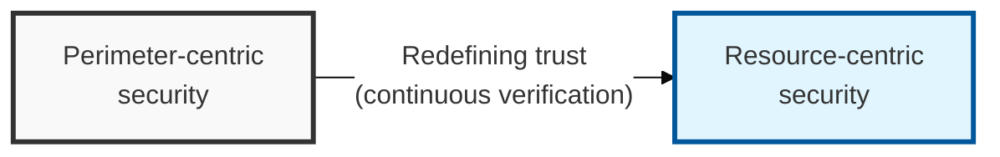
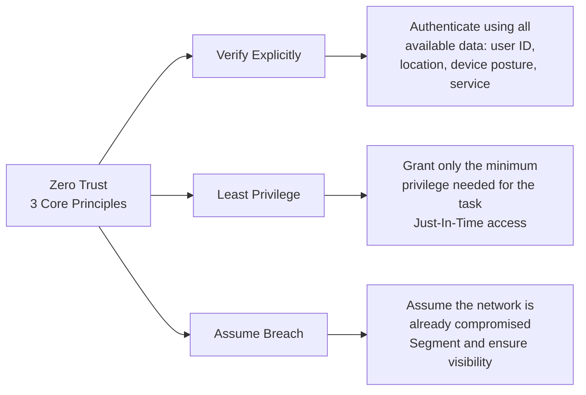

## I. Overview

**Definition**: A security model that eliminates the distinction between internal and external, trusting nothing that accesses a resource — user, device, or network — and continuously verifying it instead.

**Features**:  
( **Perimeter Collapse** ) The spread of cloud adoption and remote work has blurred the traditional network perimeter.  
( **Insider Threats** ) Data leakage and misuse by trusted internal users are increasing.  
( **APT Response** ) Detecting intrusions and blocking lateral movement is required to counter advanced persistent threats.

## II. Mechanism & Components

### Three Core Principles of Zero Trust

### Zero Trust Core Architecture and Components

| Core Component | Primary Role and Technology | Detailed Description |
|--------------|----------------|---------|
| Control Plane | Policy Engine / Admin | Calculates a trust score and makes the final decision on whether to allow resource access |
| Data Plane | PEP (Enforcement Point) | Creates or blocks the actual traffic path according to policy (Gatekeeper) |
| Security Technology | Micro-Segmentation | Breaks the network into small segments to block an attacker's lateral movement |

## III. Outlook & Future Direction

| Aspect | Legacy Posture | Direction |
|---|---|---|
| Trust model | Perimeter-based, network location implies trust | Continuous, per-request verification (NIST SP 800-207) |
| Rollout pattern | All-or-nothing architecture replacement | Phased, applied to core assets first, running alongside the existing perimeter |

Zero Trust succeeds or fails on the quality of the trust signals feeding the policy engine, not on the enforcement mechanism itself — a PEP making decisions off nothing but ID/password is Zero Trust in name only. Expect the real maturity curve over the next few years to be less about ripping out perimeter controls and more about steadily enriching the signal set (device posture, behavioral biometrics, access location) that the policy engine scores against, since a phased rollout that skips straight to enforcement without that signal foundation just relocates the old perimeter's blind trust into a shinier policy engine.
