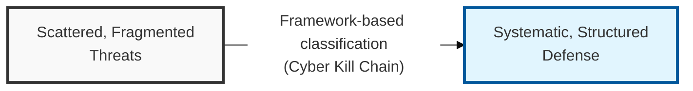
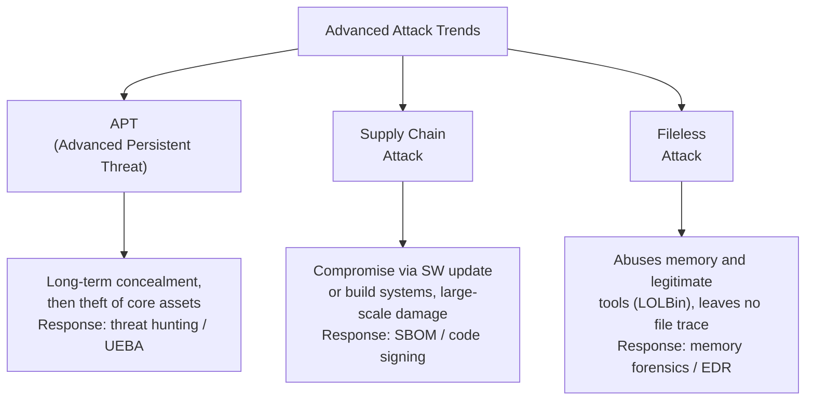

## I. Overview

**Definition**: A security analysis framework that systematizes cyberattacks by stage, layer, and objective in order to optimize defense strategy development and the use of threat intelligence.

**Features**:  
( **Threat Visibility** ) Classifies an attacker's tactics, techniques, and procedures ( **TTPs** ) using a standardized language, enabling the creation of sophisticated detection rules.  
( **Proactive Defense** ) Enables a staged blocking strategy based on the Cyber Kill Chain, which cuts the chain of an attack at any link.  
( **Collaboration Optimization** ) Maximizes the efficiency of security operations ( **SecOps** ) by sharing threat information and standardizing the incident response process.

## II. Mechanism & Components

### A. Attack Flow by Kill Chain Stage

```mermaid
flowchart LR
    A["① Reconnaissance\nGathering target information"] -->|"OSINT / scanning"| B["② Weaponization\nCrafting the malware"]
    B -->|"Packaging the exploit"| C["③ Delivery\nEmail / USB"]
    C -->|"Phishing / drive-by"| D["④ Exploitation\nTriggering the vulnerability"]
    D -->|"Code execution"| E["⑤ Installation\nInstalling a RAT / backdoor"]
    E -->|"Establishing persistence"| F["⑥ Command & Control (C2)\nRemote control channel"]
    F -->|"Issuing commands"| G["⑦ Actions on Objectives\nData theft / destruction"]
```

> **Key Point**: Blocking the early stages of the kill chain (reconnaissance and delivery) is the most cost-effective defense strategy.

### B. Attack Techniques and Response Strategy by Kill Chain Stage

| Kill Chain Stage | Key Attack Techniques | Detection / Response |
|------------|-------------|----------------|
| Reconnaissance | OSINT, Shodan scanning, DNS enumeration | Minimize externally exposed information, operate honeypots |
| Weaponization | Exploit kits, macro malware creation | Collect IoCs based on threat intelligence |
| Delivery | Spear-phishing email, drive-by download | Email sandboxing, URL filtering |
| Exploitation | Zero-day, SQL injection, buffer overflow | Patch management, WAF, IPS |
| Installation | Rootkits, web shells, registry persistence | EDR, integrity monitoring |
| Command & Control (C2) | HTTP/DNS tunneling, Tor-based covert channels | Anomalous traffic detection, DNS sinkholing |
| Actions on Objectives | Ransomware, data exfiltration, destruction | UEBA, DLP, backup and recovery |

## III. Vulnerabilities & Security Measures

### A. Classification by OSI Layer and Attack Target

| Attack Layer | Representative Techniques | Objective | Key Countermeasures |
|---------|------------|------|-------------|
| Application layer | SQL injection, XSS, CSRF, XXE | Data theft / privilege theft | WAF, secure coding, SAST/DAST |
| Network layer | DDoS, IP spoofing, MITM, ARP spoofing | Service disruption / eavesdropping | IDS/IPS, anti-DDoS, VPN |
| System layer | Ransomware, buffer overflow, privilege escalation | System takeover / file encryption | EDR, least privilege, ASLR |
| Social engineering layer | Phishing, smishing, voice phishing, pretexting | Credential theft / trust abuse | Security awareness training, enforced MFA |

Layer-based classification only pays off if the countermeasure budget is mapped to where the team actually has eyes — a WAF rule tuned for the application layer is dead weight if no one is watching network-layer traffic for the lateral movement that follows, so audit staffing and tooling coverage against this table before buying another point solution.

### B. Latest Advanced Attack Trends and Their Countermeasures

| Attack Type | Characteristics | Representative Cases | Key Response |
|---------|------|---------|---------|
| APT (Advanced Persistent Threat) | Long-term dwell time, focused targeting, multi-stage attack | Lazarus, APT41 | Threat hunting, MITRE ATT&CK mapping |
| Supply Chain Attack | Indirect infiltration through trusted software or vendors | SolarWinds, XZ Utils | SBOM management, code signing verification |
| Fileless Attack | Abuses legitimate processes (PowerShell, WMI) | Cobalt Strike | Behavior-based detection, memory analysis |

Notice that none of these three trends map cleanly onto a single OSI layer or a single control in the table above — a modern intrusion typically chains a supply-chain foothold into fileless, in-memory persistence and APT-style dwell time, which is exactly why single-layer defenses fail against them. The practical takeaway: fund cross-layer visibility (EDR plus UEBA plus threat hunting working from the same data) over adding one more layer-specific tool.

> **Key Point**: Classification is only useful insofar as it drives where the security budget goes — map every attack layer and trend in this table to an owned control and a named team, or the taxonomy is just documentation.
