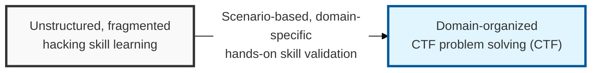
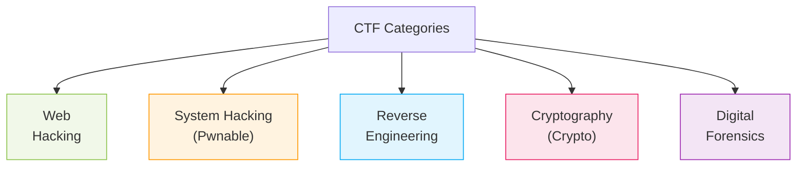

## I. Overview

**Definition**: **CTF** (Capture The Flag) is a hacking and defense competition in which participants solve information security challenges to find a hidden string called a flag ( **Flag** ) and earn points — a contest that comprehensively evaluates security skill across multiple domains.

**Features**:  
( **Hands-on Skill Development** ) Strengthens real exploitation skills beyond theory, through challenges that reflect the latest vulnerabilities and attack techniques.  
( **Problem-Solving Ability** ) Builds creative thinking ( **Thinking out of the box** ) by requiring participants to analyze complex logic and find a bypass within a limited time.  
( **Teamwork and Collaboration** ) Provides experience in solving large, complex problems as specialists in different domains collaborate under team-based competition.  
( **Security Talent Discovery** ) Uses an objective scoring system as a yardstick for identifying and evaluating skilled white-hat hackers.

## II. Mechanism & Components

### A. The Five Core Categories

### B. Key Attack Points and Core Skills by Category

| Category | Key Target and Content | Core Skills / Vulnerabilities |
|:---:|----------------------|------------------|
| **Web** | Analyzing vulnerabilities in web applications and servers | **SQLi**, **XSS**, **LFI/RFI**, **SSRF**, **Deserialization** |
| **Pwnable** | Exploiting memory flaws in executable binaries | **Buffer Overflow**, **FSB**, **ROP**, **Heap Exploit** |
| **Reversing** | Analyzing and bypassing the logic of compiled programs | **Static/Dynamic Analysis**, **Anti-Debugging**, **Packing** |
| **Crypto** | Detecting flaws in cryptographic algorithms and recovering plaintext | **RSA/AES Attack**, **Hash Collision**, **Padding Oracle** |
| **Forensics** | Tracing evidence in files, network packets, and memory | **File Carving**, **PCAP Analysis**, **Memory Forensics** |
| **Misc** | Programming, general knowledge, puzzles, and other areas | **Python Scripting**, **Steganography**, **PPC** |

## III. Comparison & Application

### A. Jeopardy vs. Attack-Defense Format

| Comparison | Jeopardy Format | Attack-Defense Format |
|:---:|-------------------------|-------------------------------|
| **Execution Method** | Solve prepared challenges to obtain flags | Simultaneously defend one's own server and attack other teams' servers |
| **Core Skill** | Deep analytical ability in a specific domain | Real-time patching and automated attacks |
| **Competition Scale** | Can accommodate large numbers of participants (mostly online) | Aimed at a small number of selected teams (mostly offline) |
| **Atmosphere** | Focused on individual/team problem solving | The urgency of real-time attack traffic analysis and response |

Don't pick a format based on which one is more popular online — pick it based on the training gap you're trying to close. Jeopardy is the better onboarding tool for building broad, per-domain depth across a large or junior team, while Attack-Defense is the only format that actually rehearses the skill most security teams lack: patching and defending a live system under active, time-pressured attack. A mature internal training program runs both, not one or the other.

### B. Selecting a Format for Internal Training Programs
- **Building foundational skill**: Run Jeopardy-style internal CTFs first, organized by domain (web, pwnable, crypto, forensics), so newer team members can specialize before being thrown into a live-fire exercise.
- **Rehearsing incident response**: Once a team has domain depth, use Attack-Defense exercises to pressure-test the exact muscle memory needed during a real incident — patching under time pressure while under active attack.
- **Automate the repetitive parts**: Encourage teams to script recurring exploitation and scanning steps ( **Pwntools**, etc.) rather than repeating manual work, since automation skill built in a CTF transfers directly to real engagement efficiency.

> **Key Point**: The choice between Jeopardy and Attack-Defense isn't a matter of preference — it's a matter of which skill gap the organization is trying to close, and the strongest internal training programs deliberately rotate between both rather than defaulting to whichever is easier to run.
