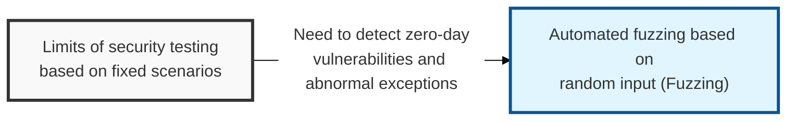
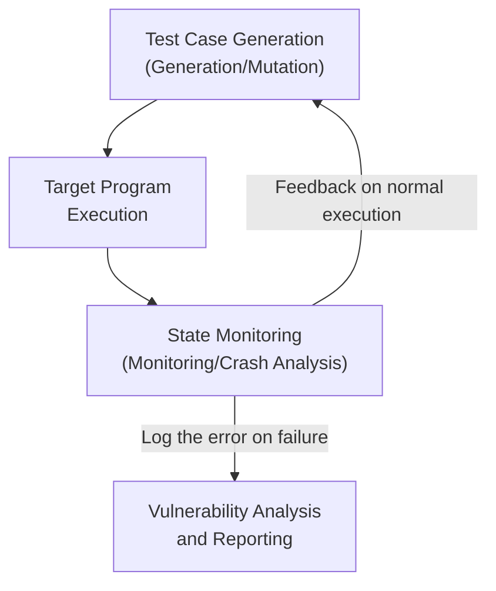

## I. Overview

**Definition**: An automated software testing technique that continuously injects random or malformed abnormal input ( **Fuzz** ) into a target program and monitors for the exceptions ( **Crash** ) that occur, in order to discover security vulnerabilities.

**Features**:  
( **Automated Detection** ) Automatically identifies logic errors and memory flaws that are difficult to find through manual analysis, by running a large number of test cases.  
( **Zero-Day Response** ) Proactively discovers previously unknown vulnerabilities ( **Zero-day** ), blocking the possibility of exploitation by an attacker.  
( **Extensibility** ) Can be flexibly applied to a wide range of interfaces, including protocols, file formats, and APIs.  
( **Code Coverage** ) Analyzes the program's executed code paths as testing progresses, improving test efficiency and accuracy ( **Feedback-driven** ).

## II. Mechanism & Components

### A. General Fuzzing Process

### B. Key Classifications by Knowledge Level and Generation Method

| Classification | Type | Detailed Description |
|:---:|--------------|--------------|
| **Knowledge Level** | **Black-box** | Checks only input/output without source code information (fast, lower accuracy) |
| | **Grey-box** | Partially uses the program's internal structure, such as coverage ( **AFL**, **LibFuzzer**, etc. ) |
| | **White-box** | Fully analyzes source code and uses symbolic execution (higher accuracy, slower) |
| **Input Generation** | **Generation** | Creates input from scratch to fit the data format rules (high probability of valid input) |
| | **Mutation** | Slightly modifies existing valid input (easy to implement, high unpredictability) |

## III. Advanced Topics & Comparison

### A. Comparison with Static and Dynamic Analysis

| Comparison | Static Analysis | Dynamic Analysis | Fuzzing |
|:---:|---------------------------|----------------------------|---------------|
| **Analysis Method** | Simple scan of source code/binary | Analyzes program state during execution | Injects abnormal input and monitors the response |
| **Key Advantage** | Easy to achieve full code coverage | Captures the context of the real execution environment | Automated, large-scale testing that finds unknown flaws |
| **Key Drawback** | High rate of false positives | Results limited to the scenarios analyzed | Consumes hardware resources, dependent on the target |
| **Key Tools** | **Fortify**, **SonarQube** | **GDB**, **OllyDbg** | **AFL**, **Peach Fuzzer**, **OSS-Fuzz** |

### B. Technical Considerations for Successful Fuzzing
- **Edge case design**: Effectively include boundary values and special characters to induce meaningful crashes.
- **Intelligent feedback loop**: Use code coverage metrics to prioritize learning from input that reaches new execution paths.
- **Automated triage**: Integrate techniques that automatically determine whether a crash is a real, exploitable security vulnerability.

> **Key Point**: Fuzzing is a powerful automated tool for validating software robustness, and it should be run continuously throughout the **SDLC** (Software Development Life Cycle) alongside **secure coding** practices.
