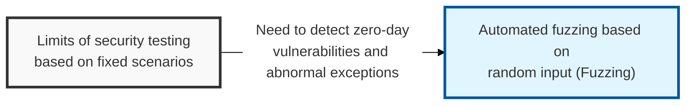
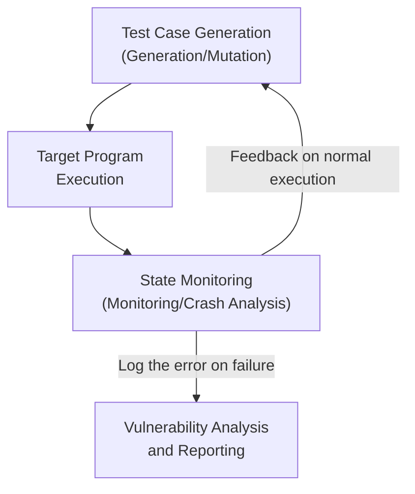

## I. Overview

**Definition**: An automated software testing technique that continuously injects random or malformed abnormal input ( **Fuzz** ) into a target program and monitors for the exceptions ( **Crash** ) that occur, in order to discover security vulnerabilities.

**Features**:  
( **Automated Detection** ) Automatically identifies logic errors and memory flaws that are difficult to find through manual analysis, by running a large number of test cases.  
( **Zero-Day Response** ) Proactively discovers previously unknown vulnerabilities ( **Zero-day** ), blocking the possibility of exploitation by an attacker.  
( **Extensibility** ) Can be flexibly applied to a wide range of interfaces, including protocols, file formats, and APIs.  
( **Code Coverage** ) Analyzes the program's executed code paths as testing progresses, improving test efficiency and accuracy ( **Feedback-driven** ).

## II. Mechanism & Components

### A. General Fuzzing Process

### B. Key Classifications by Knowledge Level and Generation Method

| Classification | Type | Detailed Description |
|:---:|--------------|--------------|
| **Knowledge Level** | **Black-box** | Checks only input/output without source code information (fast, lower accuracy) |
| | **Grey-box** | Partially uses the program's internal structure, such as coverage ( **AFL**, **LibFuzzer**, etc. ) |
| | **White-box** | Fully analyzes source code and uses symbolic execution (higher accuracy, slower) |
| **Input Generation** | **Generation** | Creates input from scratch to fit the data format rules (high probability of valid input) |
| | **Mutation** | Slightly modifies existing valid input (easy to implement, high unpredictability) |

## III. Outlook & Future Direction

| Approach | Status | Direction |
|---|---|---|
| Black/white-box fuzzing | Established practice | Still used for targeted, deep single-target analysis |
| Coverage-guided grey-box fuzzing (AFL-style) | Mainstream default | Baseline expectation for any continuous, CI-integrated fuzzing setup |
| AI/LLM-assisted seed and grammar generation | Early, fast-growing adoption | Shortening time-to-first-crash on deeply structured formats (protocols, file formats, parsers) |

Coverage-guided fuzzing already solved "where should the fuzzer look" through feedback-driven path discovery — the open problem now is "how fast can it generate valid-enough input for formats with heavy structure," and that's precisely the gap AI-assisted seed and grammar generation is closing. The practical shift for most teams isn't "should we fuzz," it's "which parsers and protocol boundaries still don't have a fuzzer pointed at them, and can generated seeds get us there faster than hand-written harnesses did."

Teams that wire continuous, coverage-guided fuzzing into CI now — rather than treating it as a pre-release checklist item — build up a multi-year corpus and crash history that a team starting later can't easily catch up on; the compounding value of a fuzzing corpus is easy to underestimate until you're the team without one.

> **Key Point**: Fuzzing is shifting from a periodic manual activity to a continuous, feedback-driven pipeline stage, and the teams investing in coverage-guided and AI-assisted tooling today are the ones who will find tomorrow's zero-days first.
