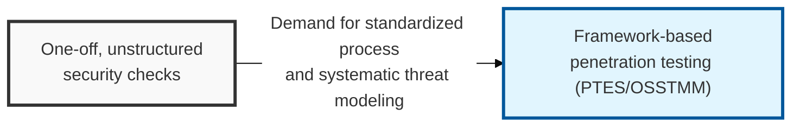
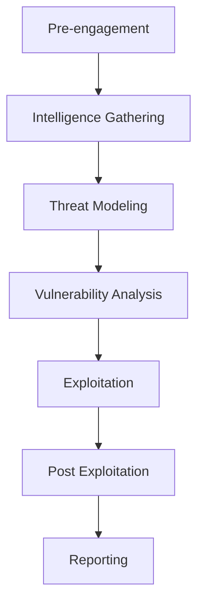

## I. Overview

**Definition**: A standardized set of procedures and a technical execution framework for attempting to penetrate an organization's information systems from an attacker's perspective in order to discover security vulnerabilities and assess the resulting risk.

**Features**:  
( **Procedural Validity** ) Applies proven frameworks such as **PTES**, **OWASP**, and **OSSTMM** to prevent gaps in assessment coverage and secure the reliability of results.  
( **Risk Prioritization** ) Assesses the real business impact of discovered vulnerabilities to support the efficient allocation of available resources.  
( **Regulatory Compliance** ) A required item for meeting major domestic and international security certifications and legal requirements such as **ISMS-P** and **PCI-DSS**.  
( **Defense Strategy Development** ) Goes beyond simply listing vulnerabilities, using penetration scenario analysis to strengthen the organization's **Defense in Depth**.

## II. Mechanism & Components

### A. Step-by-Step Execution Process

### B. Key Activities by Stage

| Stage | Key Activities | Key Output |
|:---:|--------------|----------------|
| **Pre-engagement** | Confirm scope, schedule, methods, and emergency contacts | **ROE** (Rules of Engagement) |
| **Intelligence Gathering** | **OSINT**, port scanning, service identification | Target asset inventory and network map |
| **Threat Modeling** | Analyze attack vectors and design the optimal penetration scenario | Threat scenarios per asset |
| **Vulnerability Analysis** | Identify flaws through automated scanning and manual assessment | List of confirmed vulnerabilities |
| **Exploitation** | Exploit identified vulnerabilities and attempt to reach the internal network | Success/failure of penetration and attack path |
| **Post Exploitation** | Simulate privilege escalation, lateral movement, and data exfiltration | Business impact data |
| **Reporting** | Detail discovered vulnerabilities and propose remediation measures | Final results report |

## III. Advanced Topics & Comparison

### A. Comparison of Test Approaches by Knowledge Level

| Comparison | Black Box | White Box | Grey Box |
|:---:|-------------------|-------------------|-------------------|
| **Information Provided** | None (Zero Knowledge) | Full information (Full Knowledge) | Partial information (Partial Knowledge) |
| **Attacker Perspective** | Similar to a real external attacker | Perspective of an internal collaborator/administrator | Perspective of a general user/partner |
| **Assessment Efficiency** | Low (time spent on discovery) | High (deep analysis possible) | Moderate |
| **Primary Purpose** | Validate the external defense perimeter | Analyze logic flaws and source code | Check for privilege abuse and insider threats |

### B. Strategies for an Effective Penetration Test
- **Understand the business context**: Design scenarios that prioritize the organization's core assets and business processes.
- **Balance automation and manual assessment**: Combine efficient tool-based scanning with an expert's creative penetration techniques.
- **Continuous feedback**: Ensure the assessment is not a one-off exercise by tracking remediation and linking results to security training.

> **Key Point**: A penetration testing methodology should be used not merely as a technical exercise, but as a core tool of **security governance** for measuring an organization's security maturity and responding to real threats.
