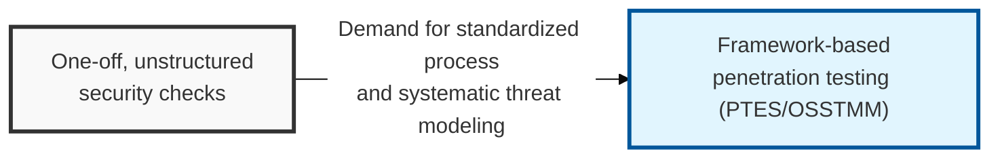
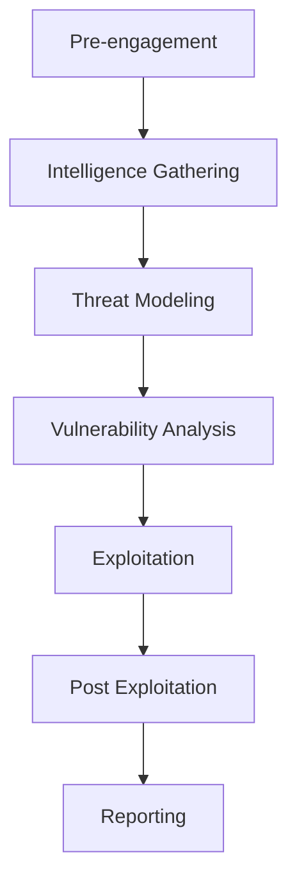

## I. Overview

**Definition**: A standardized set of procedures and a technical execution framework for attempting to penetrate an organization's information systems from an attacker's perspective in order to discover security vulnerabilities and assess the resulting risk.

**Features**:  
( **Procedural Validity** ) Applies proven frameworks such as **PTES**, **OWASP**, and **OSSTMM** to prevent gaps in assessment coverage and secure the reliability of results.  
( **Risk Prioritization** ) Assesses the real business impact of discovered vulnerabilities to support the efficient allocation of available resources.  
( **Regulatory Compliance** ) A required item for meeting major domestic and international security certifications and legal requirements such as **ISMS-P** and **PCI-DSS**.  
( **Defense Strategy Development** ) Goes beyond simply listing vulnerabilities, using penetration scenario analysis to strengthen the organization's **Defense in Depth**.

## II. Mechanism & Components

### A. Step-by-Step Execution Process

### B. Key Activities by Stage

| Stage | Key Activities | Key Output |
|:---:|--------------|----------------|
| **Pre-engagement** | Confirm scope, schedule, methods, and emergency contacts | **ROE** (Rules of Engagement) |
| **Intelligence Gathering** | **OSINT**, port scanning, service identification | Target asset inventory and network map |
| **Threat Modeling** | Analyze attack vectors and design the optimal penetration scenario | Threat scenarios per asset |
| **Vulnerability Analysis** | Identify flaws through automated scanning and manual assessment | List of confirmed vulnerabilities |
| **Exploitation** | Exploit identified vulnerabilities and attempt to reach the internal network | Success/failure of penetration and attack path |
| **Post Exploitation** | Simulate privilege escalation, lateral movement, and data exfiltration | Business impact data |
| **Reporting** | Detail discovered vulnerabilities and propose remediation measures | Final results report |

## III. Expected Benefits & Implications

A formal methodology earns its value at the exact moment a finding gets disputed, not at the moment it's discovered — when a vulnerability report lands in front of a skeptical engineering team months later asking "are you sure this is exploitable," the only real leverage a pentester has is a documented, repeatable methodology that shows the result wasn't a fluke or a misconfigured scanner. Treat the methodology write-up as evidence, not paperwork.

| Benefit | Where It Shows Up |
|---|---|
| Defensible, reproducible findings | Post-engagement disputes and remediation pushback |
| Full assessment coverage, no blind spots | Audit and certification review ( **ISMS-P**, **PCI-DSS** ) |
| Business-prioritized remediation | Limited patching budget and competing engineering priorities |
| Consistent quality across assessors | Repeat engagements and multi-vendor testing programs |

The knowledge-level choice — black, white, or grey box — is itself a methodology decision with a direct cost/benefit trade-off: black box buys realism but costs discovery time, white box buys depth but loses the "can an outsider actually get in" narrative that resonates with leadership. Most mature programs don't pick one permanently; they rotate the knowledge level year over year so the same asset gets tested from a different angle each cycle, which is worth more over time than repeatedly re-validating the same blind spots.

> **Key Point**: A penetration testing methodology pays for itself not in the vulnerabilities it finds, but in the credibility and consistency it gives the organization to act on those findings — treat it as a security governance investment, not a one-off technical exercise.
