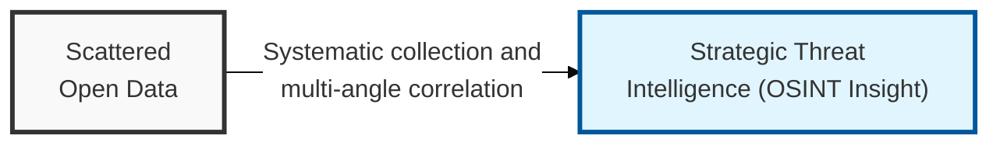
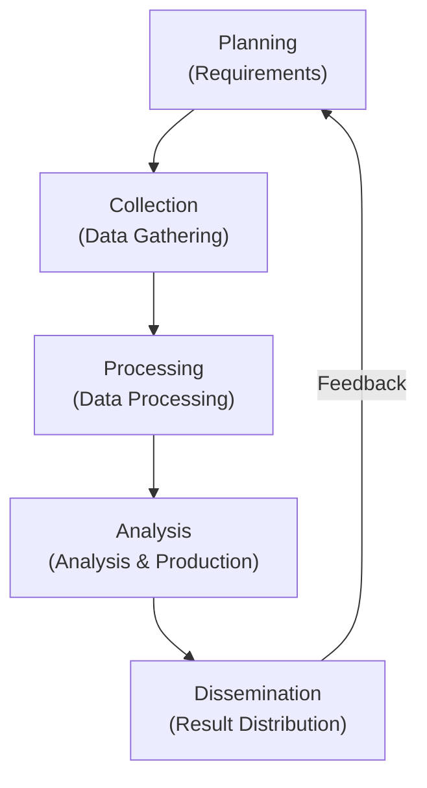

## I. Overview

**Definition**: A set of activities that collects and analyzes data from legally accessible public sources ( **Open Source** ) to derive meaningful information ( **Intelligence** ) that serves a specific purpose.

**Features**:  
( **Non-intrusive Collection** ) Gathers externally exposed information without directly probing the target system, so the risk of detection is low.  
( **Attack Surface Mapping** ) Identifies an organization's externally exposed assets ( **Attack Surface** ) and predicts penetration paths, from an attacker's viewpoint.  
( **Decision Support** ) Used across multiple security strategies, including reputation management, threat-actor tracking, and supply chain risk management.  
( **Economy and Efficiency** ) Enables in-depth preliminary research using the vast amount of data available on the internet, without expensive equipment.

## II. Mechanism & Components

### A. The Five-Stage Intelligence Cycle

### B. Key Sources and Tools

| Category | Key Source Content | Representative Tools |
|:---:|--------------|--------------|
| **Search Engines** | Discovering sensitive files using advanced search operators | **Google Dorking**, **Bing** |
| **Infrastructure/IoT** | Domains, IPs, open ports, vulnerable IoT device information | **Shodan**, **Censys**, **Whois** |
| **Social Media/People** | Employee profiles, email addresses, mentioned tech stack | **LinkedIn**, **TheHarvester**, **Hunter.io** |
| **Technical Data** | Keywords in source code, hardcoded API keys | **GitHub**, **Wayback Machine**, **VirusTotal** |
| **Visualization/Analysis** | Analyzing and visualizing relationships among scattered information | **Maltego**, **SpiderFoot** |

## III. Adoption Considerations

| Risk | Mitigation |
|---|---|
| Legal/privacy exposure from collecting or storing public data | Written collection scope and guidelines aligned with applicable privacy law |
| Acting on fake, outdated, or deliberately manipulated open-source data | Cross-check every finding across independent sources before treating it as fact |
| Analyst time lost to data overload with no clear signal | Automated filtering/analysis tooling, scoped collection requirements up front |
| The organization itself being OSINT'd by an attacker | Minimize externally exposed assets, monitor digital footprint, train staff on info hygiene |

The riskiest moment in OSINT work isn't the collection itself — it's the single-source claim that gets escalated as confirmed fact without corroboration. Treat every OSINT finding as a lead to verify, never as ground truth on its own, and budget analyst time for cross-checking accordingly; teams that skip this step end up chasing false positives generated by someone else's disinformation.

On the defensive side, don't wait for a red team engagement to discover what's externally exposed — task someone with running the organization's own OSINT footprint check on a recurring schedule, because real attackers already are, for free, right now.

> **Key Point**: OSINT is a two-way discipline — the same techniques an organization uses to map its own attack surface are the ones an attacker uses against it, so a mature OSINT program budgets equally for offensive collection discipline and defensive footprint management.
