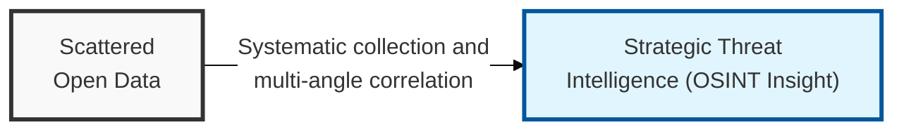
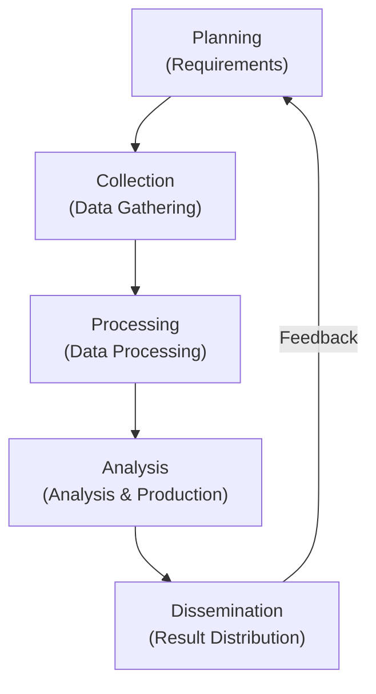

## I. Overview

**Definition**: A set of activities that collects and analyzes data from legally accessible public sources ( **Open Source** ) to derive meaningful information ( **Intelligence** ) that serves a specific purpose.

**Features**:  
( **Non-intrusive Collection** ) Gathers externally exposed information without directly probing the target system, so the risk of detection is low.  
( **Attack Surface Mapping** ) Identifies an organization's externally exposed assets ( **Attack Surface** ) and predicts penetration paths, from an attacker's viewpoint.  
( **Decision Support** ) Used across multiple security strategies, including reputation management, threat-actor tracking, and supply chain risk management.  
( **Economy and Efficiency** ) Enables in-depth preliminary research using the vast amount of data available on the internet, without expensive equipment.

## II. Mechanism & Components

### A. The Five-Stage Intelligence Cycle

### B. Key Sources and Tools

| Category | Key Source Content | Representative Tools |
|:---:|--------------|--------------|
| **Search Engines** | Discovering sensitive files using advanced search operators | **Google Dorking**, **Bing** |
| **Infrastructure/IoT** | Domains, IPs, open ports, vulnerable IoT device information | **Shodan**, **Censys**, **Whois** |
| **Social Media/People** | Employee profiles, email addresses, mentioned tech stack | **LinkedIn**, **TheHarvester**, **Hunter.io** |
| **Technical Data** | Keywords in source code, hardcoded API keys | **GitHub**, **Wayback Machine**, **VirusTotal** |
| **Visualization/Analysis** | Analyzing and visualizing relationships among scattered information | **Maltego**, **SpiderFoot** |

## III. Advanced Topics & Comparison

### A. Key Limitations and Considerations of OSINT

| Category | Key Content | Response |
|:---:|----------|----------|
| **Information Reliability** | Fake news or deliberately manipulated data may exist | Cross-check using multiple sources |
| **Data Overload** | Difficulty identifying meaningful information within a vast volume of data | Use automated analysis tools and filtering algorithms |
| **Ethics and Legality** | Even public information may raise legal issues, such as under privacy law | Follow guidelines and strictly manage the scope of collection |

### B. Organizational Defense Strategy Against OSINT (Anti-OSINT)
- **Minimize externally exposed assets**: Block external exposure of unnecessary domains, test servers, and development pages.
- **Raise employee security awareness**: Train staff to prevent leakage of work-related information (tech stack, internal photos, etc.) via social media.
- **Manage digital footprint**: Periodically monitor organization-related keywords and promptly request removal of exposed sensitive data.

> **Key Point**: In **OSINT**, the quality of analysis matters more than the quantity of information, and proactively managing the weaknesses identified through it is the starting point of modern **Attack Surface Management (ASM)**.
