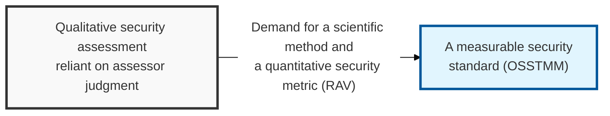
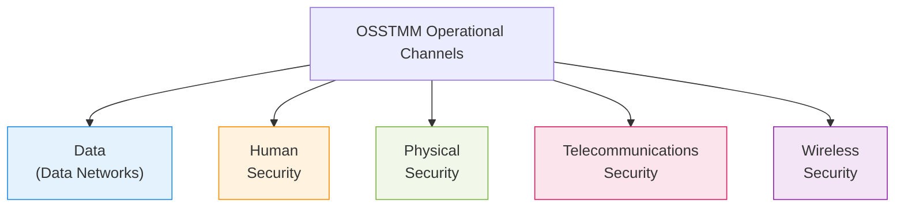

## I. Overview

**Definition**: A security testing standard developed by **ISECOM** (Institute for Security and Open Methodologies) that scientifically and quantitatively measures the effectiveness of security controls in order to assess an organization's security maturity.

**Features**:  
( **Quantitative Metric** ) Objectively quantifies security posture through a numeric value called the **RAV** (Risk Assessment Value), supporting executive decision-making.  
( **Scientific Methodology** ) Divides the target of testing into five operational channels and applies a consistent verification process to each.  
( **Comprehensive Scope** ) Goes beyond simple technical checks, performing an integrated assessment that covers human, physical, and wireless security as well.  
( **Open Source Standard** ) A transparent standard continuously updated by security experts worldwide, providing globally trusted security assurance.

## II. Mechanism & Components

### A. The Five Operational Channels of Security Testing

### B. Key Analytical Concepts and Process Characteristics

| Key Concept | Detailed Description | Security Value |
|:---:|----------|----------|
| **RAV** | **Risk Assessment Value** | Calculates the actual effectiveness of security controls ( **Security Actual** ) as a value between 0 and 100 |
| **Porosity** | The weaknesses (openings) through which the interior of a system can be penetrated | Measures the degree of external exposure and attack likelihood |
| **Separation** | The level of separation and independence between security controls | Verifies the effectiveness of **Defense in Depth** |
| **Limitations** | The inherent limits present within a security system | Identifies residual risk and informs response strategy |

## III. Advanced Topics & Comparison

### A. Comparison of Major Security Methodologies

| Comparison | PTES (Execution Standard) | OSSTMM (Methodology Manual) |
|:---:|--------------------------|----------------------------|
| **Primary Goal** | **Standardizing the execution stages** of penetration testing | **Scientific/quantitative measurement** of security controls |
| **Output Format** | Focused on a technical vulnerability report | A statistical report based on the **RAV** metric |
| **Assessment Perspective** | Whether penetration succeeded (attacker's view) | Operational effectiveness of security controls (defender's view) |
| **Strength** | Concrete hacking technique guidelines | Quantitative figures suitable for executive reporting |

### B. Recommendations for Effective Use of OSSTMM
- **Link the RAV metric to the business**: Actively use **RAV** as a metric for demonstrating the **ROI** of security budget investment.
- **Integrated channel testing**: Combine human security (social engineering) checks with physical security checks alongside IT infrastructure testing for full-spectrum security visibility.
- **Support regulatory compliance**: Use it as objective evidence for domestic and international certifications ( **ISMS-P**, **ISO 27001**, etc. ) that require measuring security maturity.

> **Key Point**: **OSSTMM** is the standard that turned security from something "felt" into something "measured," and it is a powerful tool for driving an organization's real security maturity through quantified data.
