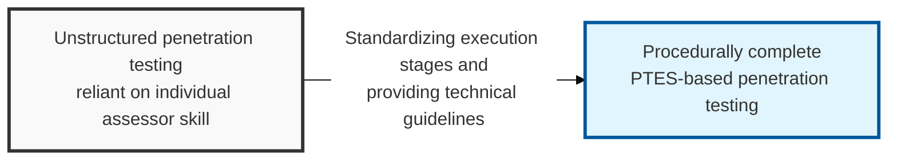
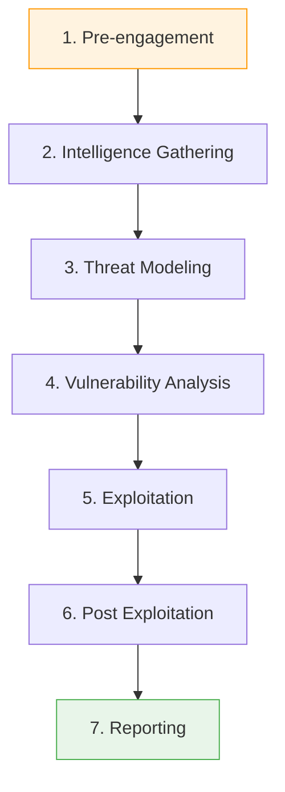

## I. Overview

**Definition**: A seven-stage technical execution standard, defined to guarantee consistent quality and systematic results across the entire penetration testing process, from pre-engagement through reporting.

**Features**:  
( **Standardized Execution** ) Minimizes quality variance driven by an assessor's subjective judgment and guarantees thorough coverage of every test area.  
( **Technical Depth** ) Provides concrete technical guidelines for each stage, rather than merely listing procedures.  
( **Business Alignment** ) Uses threat modeling to focus on discovering real vulnerabilities that are directly tied to the organization's business risk.  
( **Transparency** ) Prevents legal and operational risk by establishing a clear **ROE** (Rules of Engagement) between the client and the assessor.

## II. Mechanism & Components

### A. The Seven Stages and Their Relationships

### B. Detailed Activities and Key Checks per Stage

| Stage | Key Activities | Key Checks |
|:---:|----------------------|--------------------------|
| **1. Pre-engagement** | Define scope, select tools, build a time plan | Confirm **ROE**, emergency contacts, whitelisted IPs |
| **2. Intelligence Gathering** | **OSINT**, social engineering prep, footprinting | Domains, IP ranges, employee information, tech stack in use |
| **3. Threat Modeling** | Identify assets and design attack vectors from an attacker's view | Business-logic vulnerability scenarios, threat prioritization |
| **4. Vulnerability Analysis** | Automated scanning, manual identification, misconfiguration checks | Unpatched vulnerabilities, default accounts, weak permission settings |
| **5. Exploitation** | Run exploits, bypass defensive controls, breach the internal network | Minimizing impact on service availability, evidence of successful penetration |
| **6. Post Exploitation** | Privilege escalation, lateral movement | Confirming data exfiltration paths, establishing persistence (backdoor) |
| **7. Reporting** | Summarize technical vulnerabilities and business risk | Remediation guidance, risk rating ( **CVSS** ) |

## III. Implications & Recommendations

PTES's seven stages matter less as a checklist to tick off and more as an insurance policy — the two stages teams most often shortcut under deadline pressure, Pre-engagement and Post Exploitation, are exactly the two that determine whether an engagement holds up legally (the ROE) and whether the client understands real business impact instead of just a raw vulnerability count. Protect those two stages' time allocation before anything else in the schedule gets cut.

| Benefit | Where It Shows Up |
|---|---|
| Consistent quality across assessors | Multi-vendor or recurring-engagement testing programs |
| Clear legal boundary before testing begins | Scope disputes raised during or after the engagement |
| Business-relevant, not just technical, findings | Executive buy-in for remediation budget |
| Demonstrated real-world impact | Prioritization arguments with engineering teams |

- **Leverage the published technical guidelines**: Reference PTES's extensive stage-by-stage technical guidelines to keep assessment tooling and scripts current rather than reinventing process per engagement.
- **Invest in threat modeling specific to the business**: Generic vulnerability scanning finds generic vulnerabilities; scenarios modeled on the target's actual business risk (e.g., fraudulent-transaction paths in finance) are what produce findings leadership actually acts on.

Teams that skip straight from vulnerability analysis to reporting — bypassing a real post-exploitation phase — end up delivering something indistinguishable from an authenticated vulnerability scan with a nicer cover page. The business-impact narrative built during post-exploitation is what actually earns remediation budget from a skeptical stakeholder, which makes it the highest-leverage stage in the entire standard, not an optional extra.

> **Key Point**: PTES's real value isn't the seven-stage checklist itself — it's the discipline it forces around scoping (Pre-engagement) and impact narrative (Post Exploitation), the two places where a rushed engagement quietly loses both its legal cover and its business credibility.
