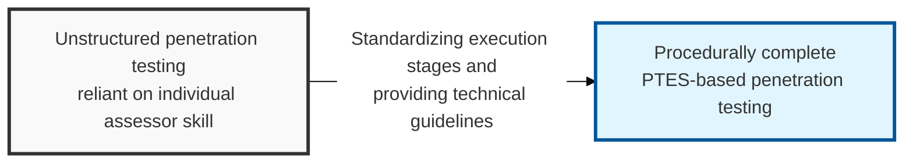
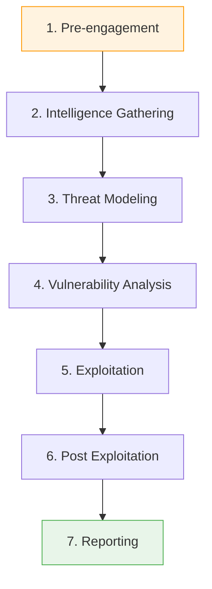

## I. Overview

**Definition**: A seven-stage technical execution standard, defined to guarantee consistent quality and systematic results across the entire penetration testing process, from pre-engagement through reporting.

**Features**:  
( **Standardized Execution** ) Minimizes quality variance driven by an assessor's subjective judgment and guarantees thorough coverage of every test area.  
( **Technical Depth** ) Provides concrete technical guidelines for each stage, rather than merely listing procedures.  
( **Business Alignment** ) Uses threat modeling to focus on discovering real vulnerabilities that are directly tied to the organization's business risk.  
( **Transparency** ) Prevents legal and operational risk by establishing a clear **ROE** (Rules of Engagement) between the client and the assessor.

## II. Mechanism & Components

### A. The Seven Stages and Their Relationships

### B. Detailed Activities and Key Checks per Stage

| Stage | Key Activities | Key Checks |
|:---:|----------------------|--------------------------|
| **1. Pre-engagement** | Define scope, select tools, build a time plan | Confirm **ROE**, emergency contacts, whitelisted IPs |
| **2. Intelligence Gathering** | **OSINT**, social engineering prep, footprinting | Domains, IP ranges, employee information, tech stack in use |
| **3. Threat Modeling** | Identify assets and design attack vectors from an attacker's view | Business-logic vulnerability scenarios, threat prioritization |
| **4. Vulnerability Analysis** | Automated scanning, manual identification, misconfiguration checks | Unpatched vulnerabilities, default accounts, weak permission settings |
| **5. Exploitation** | Run exploits, bypass defensive controls, breach the internal network | Minimizing impact on service availability, evidence of successful penetration |
| **6. Post Exploitation** | Privilege escalation, lateral movement | Confirming data exfiltration paths, establishing persistence (backdoor) |
| **7. Reporting** | Summarize technical vulnerabilities and business risk | Remediation guidance, risk rating ( **CVSS** ) |

## III. Advanced Topics & Comparison

### A. PTES Compared with Other Security Frameworks

| Category | PTES | OSSTMM | NIST SP 800-115 |
|:---:|------|--------|----------------|
| **Core Character** | Centered on the **execution process** of penetration testing | Centered on **operational metrics** for security testing | A **technical assessment guide** for government/institutions |
| **Strength** | Provides concrete technical guidelines | Enables quantitative measurement ( **RAV** ) | A systematic, conservative approach |
| **Recommended Use** | Commercial services and corporate penetration testing | Measuring and quantifying security maturity | Public institutions and regulatory compliance targets |

### B. Recommendations for Successful PTES Adoption
- **Leverage the technical guidelines**: Reference the extensive technical guidelines published on the official PTES website to optimize assessment tools and scripts.
- **Strengthen threat modeling**: Go beyond finding known vulnerabilities and perform modeling that reflects threats specific to the target organization (e.g., fraudulent-transaction scenarios in the financial sector).
- **The importance of post exploitation**: Visualize the real scale of damage from a security incident by demonstrating post-breach scenarios such as data exfiltration paths.

> **Key Point**: **PTES** is the standard that elevated penetration testing from a simple "check" to a "strategic security validation," and it guarantees both assessor and client a clear benchmark and high-quality results.
