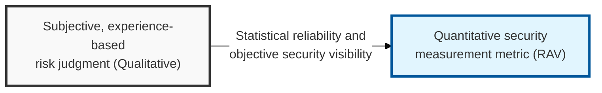
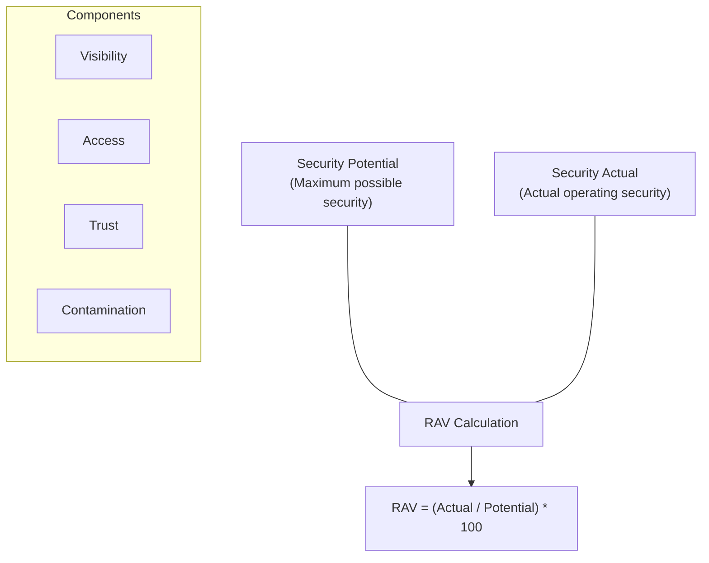

## I. Overview

**Definition**: A quantitative security measurement metric used in the **OSSTMM** methodology, which mathematically calculates the real effectiveness of the security controls within a given operational channel and expresses it as a value between 0 and 100.

**Features**:  
( **Objectivity** ) Excludes the assessor's subjective judgment and measures security maturity based on a mathematical formula, maximizing the reliability of the result.  
( **Optimized Decision-Making** ) Can numerically demonstrate the **ROI** of security investment and clearly identifies which areas need improvement first.  
( **Comparability** ) Applies the same formula so security levels can be compared across sites and over time, enabling long-term security trend management.  
( **Integrated View** ) Reflects not only technical vulnerabilities but also core elements of security operations such as visibility, access, and trust in an integrated way.

## II. Mechanism & Components

### A. RAV Calculation Formula and Principle

### B. The Five Key Metrics That Determine RAV

| Metric | Detailed Description | Effect on the Score |
|:---:|----------|----------|
| **Visibility** | How much information about the target system can be identified from the outside (degree of information exposure) | Lower is better for security |
| **Access** | How many paths and points of entry exist for reaching the target system | Lower is better for security |
| **Trust** | The complexity and scope of the trust relationships established between systems and users | Lower (least privilege) is better for security |
| **Contamination** | Whether paths exist through which abnormal data or code can be injected | Lower is better for security |
| **Porosity** | The degree of small gaps through which security controls can be bypassed or passed through | Lower is better for security |

## III. Advanced Topics & Comparison

### A. RAV vs. CVSS (Common Vulnerability Scoring System)

| Comparison | CVSS (Risk Score) | RAV (Security Metric) |
|:---:|----------------|----------------|
| **Unit of Analysis** | An individual **vulnerability** | A security **control/channel** |
| **Measurement Perspective** | Severity and ease of exploitation of the vulnerability | The actual operational effectiveness of the security system |
| **Primary Use** | Determining patch priority | Measuring overall security maturity and ROI |
| **Score Interpretation** | Higher score means higher risk (0–10) | Higher score means safer (0–100) |

### B. Strengthening Security Governance with the RAV Metric
- **Build a security visibility dashboard**: Visualize the **RAV** metric for each channel (network, human, physical, etc.) and feed it into integrated security monitoring.
- **Vulnerability remediation guidance**: Go beyond simple patch recommendations and propose architectural improvements that address the root cause of a lower **RAV** score (e.g., excessive visibility exposure).
- **Standardize periodic security audits**: Report quantitative changes in the organization's security maturity based on annual/quarterly **RAV** measurement data.

> **Key Point**: **RAV** is an innovative metric that turned security from an abstract concept into "measurable data," enabling organizations to build a more scientific, evidence-driven security program.
