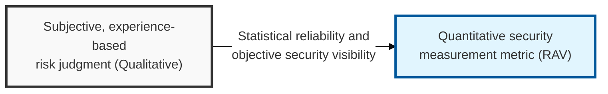
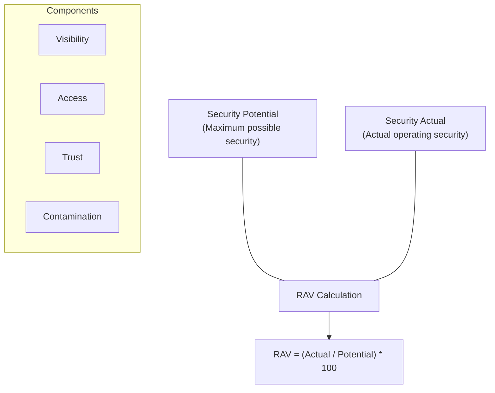

## I. Overview

**Definition**: A quantitative security measurement metric used in the **OSSTMM** methodology, which mathematically calculates the real effectiveness of the security controls within a given operational channel and expresses it as a value between 0 and 100.

**Features**:  
( **Objectivity** ) Excludes the assessor's subjective judgment and measures security maturity based on a mathematical formula, maximizing the reliability of the result.  
( **Optimized Decision-Making** ) Can numerically demonstrate the **ROI** of security investment and clearly identifies which areas need improvement first.  
( **Comparability** ) Applies the same formula so security levels can be compared across sites and over time, enabling long-term security trend management.  
( **Integrated View** ) Reflects not only technical vulnerabilities but also core elements of security operations such as visibility, access, and trust in an integrated way.

## II. Mechanism & Components

### A. RAV Calculation Formula and Principle

### B. The Five Key Metrics That Determine RAV

| Metric | Detailed Description | Effect on the Score |
|:---:|----------|----------|
| **Visibility** | How much information about the target system can be identified from the outside (degree of information exposure) | Lower is better for security |
| **Access** | How many paths and points of entry exist for reaching the target system | Lower is better for security |
| **Trust** | The complexity and scope of the trust relationships established between systems and users | Lower (least privilege) is better for security |
| **Contamination** | Whether paths exist through which abnormal data or code can be injected | Lower is better for security |
| **Porosity** | The degree of small gaps through which security controls can be bypassed or passed through | Lower is better for security |

## III. Comparative Analysis

### A. RAV vs. CVSS (Common Vulnerability Scoring System)

| Comparison | CVSS (Risk Score) | RAV (Security Metric) |
|:---:|----------------|----------------|
| **Unit of Analysis** | An individual **vulnerability** | A security **control/channel** |
| **Measurement Perspective** | Severity and ease of exploitation of the vulnerability | The actual operational effectiveness of the security system |
| **Primary Use** | Determining patch priority | Measuring overall security maturity and ROI |
| **Score Interpretation** | Higher score means higher risk (0–10) | Higher score means safer (0–100) |

RAV and CVSS answer different questions and shouldn't compete for the same slot on a dashboard. Use CVSS to drive the week-to-week patch queue and RAV to drive the quarterly conversation about whether the security program as a whole is actually improving — a team that only tracks CVSS can close every critical vulnerability in a quarter and still have no idea whether its overall attack surface shrank, because CVSS has nothing to say about visibility, access, or trust at the system level.

### B. Applying Both Metrics Together
- **Patch triage, day to day**: Let CVSS drive the tactical remediation queue — it's the right tool for "what do we fix first this sprint."
- **Program reporting, quarter to quarter**: Feed **RAV** into a per-channel dashboard (network, human, physical) so leadership sees a trend line instead of a fluctuating vulnerability count.
- **Root-cause framing**: When a channel's **RAV** score is low, resist the urge to treat it as a patching problem — trace it back to excessive visibility, access, or trust exposure and propose an architectural fix, not just another patch.

> **Key Point**: CVSS and RAV are complementary, not competing, metrics — the mistake is picking one and discarding the other, when the real governance value comes from running tactical CVSS triage and strategic RAV trend-tracking side by side.
