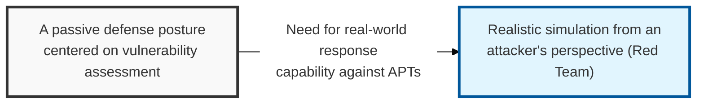
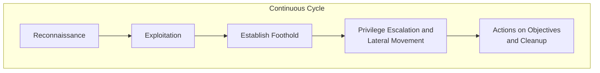

## I. Overview

**Definition**: A specialized group or activity that, in order to validate the effectiveness of an organization's security defenses ( **Blue Team** ), mimics the strategies, techniques, and procedures ( **TTPs** ) of a real attacker to carry out an unannounced, realistic attack.

**Features**:  
( **Attacker's Perspective** ) Searches for security gaps and secures penetration paths from the viewpoint of an actual hacker, rather than following internal guidelines.  
( **Realism Guaranteed** ) Conducted without prior notice, so it genuinely evaluates the response capability of both detection systems and the human response organization.  
( **Comprehensive Assessment** ) Applies an all-encompassing threat scenario that spans not only network and system security but also physical security and social engineering.  
( **Advancing the Defense Program** ) Analyzes successful attack cases to strengthen the Blue Team's detection and response processes, providing the foundation for **Purple Teaming**.

## II. Mechanism & Components

### A. Staged Red Team Attack Process

### B. Key Red Team Strategies and Techniques (TTPs)

| Stage | Key Activities | Representative Techniques |
|:---:|--------------|--------------|
| **Recon** | Researching the target organization's infrastructure, employee information, and security equipment | **OSINT**, social media analysis, network scanning |
| **Delivery** | Delivering malware or a phishing page to the target | Spear phishing, USB drop |
| **Exploit** | Gaining access to the internal network by exploiting a vulnerability or deceiving a user | Zero-day, known vulnerabilities, social engineering |
| **Control** | Controlling the compromised system from outside ( **C&C** ) | Covert communication channels ( **DNS Tunneling** ), traffic over non-standard ports |
| **Movement** | Moving to other critical servers within the internal network while acquiring further privileges | **Pass-the-Hash**, **Kerberoasting**, **AD** attacks |

## III. Advanced Topics & Comparison

### A. Key Differences Between Red Teaming and Penetration Testing

| Comparison | Penetration Testing | Red Teaming |
|:---:|------------------------------|----------------------|
| **Core Purpose** | Identify and enumerate vulnerabilities (comprehensive survey) | Achieve a specific objective and validate the defense program (realism) |
| **Scope** | Limited to a specific system, web app, or application | Unrestricted, spanning enterprise-wide infrastructure, physical security, and people |
| **Methodology** | Follows a fixed scenario and schedule | Uses the same unstructured techniques as a real attacker |
| **Notification** | Agreed and announced in advance with the management team | Conducted without warning (the Blue Team is unaware) |
| **Deliverable** | A list of vulnerabilities and a patch guide | A report analyzing the effectiveness of the response to each attack scenario |

### B. Future Direction: Purple Teaming
- **Concept**: A collaborative model in which the Red Team (attack) and Blue Team (defense) are not siloed, but share attack data in real time to improve detection rules and drive automated response.
- **Effect**: Delivers real defensive visibility and maximizes the efficiency of security operations, grounded in a deep understanding of attack techniques.

> **Key Point**: The purpose of a Red Team is not simply "breaking in," but proactively finding an organization's weaknesses through "the eyes of an attacker" so the organization builds genuine **resilience**.
