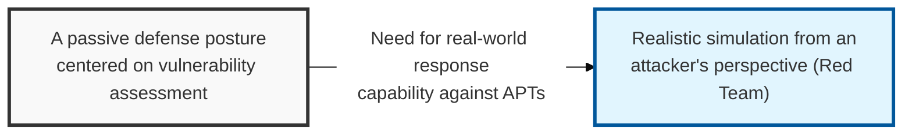
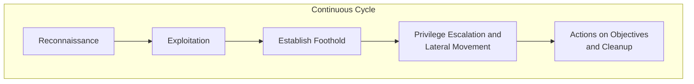

## I. Overview

**Definition**: A specialized group or activity that, in order to validate the effectiveness of an organization's security defenses ( **Blue Team** ), mimics the strategies, techniques, and procedures ( **TTPs** ) of a real attacker to carry out an unannounced, realistic attack.

**Features**:  
( **Attacker's Perspective** ) Searches for security gaps and secures penetration paths from the viewpoint of an actual hacker, rather than following internal guidelines.  
( **Realism Guaranteed** ) Conducted without prior notice, so it genuinely evaluates the response capability of both detection systems and the human response organization.  
( **Comprehensive Assessment** ) Applies an all-encompassing threat scenario that spans not only network and system security but also physical security and social engineering.  
( **Advancing the Defense Program** ) Analyzes successful attack cases to strengthen the Blue Team's detection and response processes, providing the foundation for **Purple Teaming**.

## II. Mechanism & Components

### A. Staged Red Team Attack Process

### B. Key Red Team Strategies and Techniques (TTPs)

| Stage | Key Activities | Representative Techniques |
|:---:|--------------|--------------|
| **Recon** | Researching the target organization's infrastructure, employee information, and security equipment | **OSINT**, social media analysis, network scanning |
| **Delivery** | Delivering malware or a phishing page to the target | Spear phishing, USB drop |
| **Exploit** | Gaining access to the internal network by exploiting a vulnerability or deceiving a user | Zero-day, known vulnerabilities, social engineering |
| **Control** | Controlling the compromised system from outside ( **C&C** ) | Covert communication channels ( **DNS Tunneling** ), traffic over non-standard ports |
| **Movement** | Moving to other critical servers within the internal network while acquiring further privileges | **Pass-the-Hash**, **Kerberoasting**, **AD** attacks |

## III. Trends & Future Direction

| Practice | Status | Direction |
|---|---|---|
| Siloed, unannounced Red Team engagements | Established, still the best test of pure realism | Increasingly paired with, not replaced by, continuous validation |
| Purple Teaming (real-time TTP sharing between Red and Blue) | Growing adoption | Becoming the default operating model for mature security programs |
| Continuous/automated adversary emulation (BAS-style tooling) | Emerging | Filling the gap between infrequent, full-scale Red Team exercises |

The annual, unannounced Red Team exercise is starting to resemble the annual pentest of a decade ago — genuinely valuable, but too infrequent on its own to catch drift in an environment that changes weekly. The real trend isn't "run more Red Team exercises," it's closing the gap between them with real-time Purple Team collaboration and continuous automated emulation, so detection gaps get surfaced and fixed in weeks instead of sitting undiscovered for a year until the next engagement.

For reference, the core distinction that still separates Red Teaming from standard penetration testing:

| Comparison | Penetration Testing | Red Teaming |
|:---:|------------------------------|----------------------|
| **Core Purpose** | Identify and enumerate vulnerabilities (comprehensive survey) | Achieve a specific objective and validate the defense program (realism) |
| **Notification** | Agreed and announced in advance with the management team | Conducted without warning (the Blue Team is unaware) |
| **Deliverable** | A list of vulnerabilities and a patch guide | A report analyzing the effectiveness of the response to each attack scenario |

> **Key Point**: The future of Red Teaming isn't bigger, rarer exercises — it's tighter feedback loops between attack and defense, with Purple Teaming and continuous emulation closing the visibility gap that a once-a-year engagement structurally can't.
