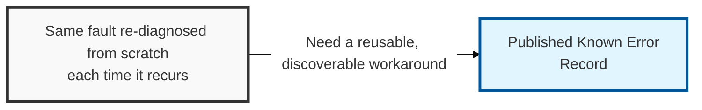
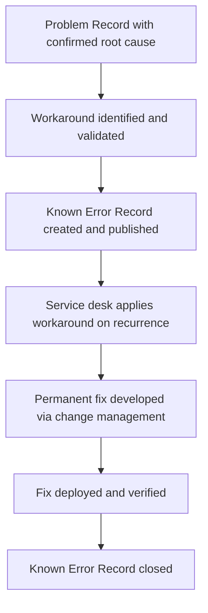

## I. Overview

**Definition**: A Known Error (KE) Record documents a problem for which the root cause has been diagnosed and a workaround identified, even though a permanent fix has not yet been implemented.

**Features**:  
( **Ownership** ) Owned and maintained by the problem manager or a designated technical lead.  
( **Publication** ) Published so service desk and incident responders can apply the workaround immediately instead of re-diagnosing the same fault.  
( **Operational Role** ) Complements incident response, which restores service fast using whatever workaround is on file.  
( **Discoverability** ) Makes the workaround discoverable and consistent across every recurrence of the fault.

## II. Structure & Process

| Field | Description |
|---|---|
| KE ID | Unique identifier linking the known error to its source Problem Record. |
| Title/Summary | Short description of the fault and its observable symptoms. |
| Root Cause | Confirmed technical cause established through root-cause analysis. |
| Workaround | Documented steps to mitigate impact until a permanent fix ships. |
| Affected Services/CIs | Systems, applications, or configuration items impacted. |
| Known Error Status | Workaround available, fix scheduled, fix deployed, or closed. |
| Linked Incidents | Incident tickets that triggered or referenced this known error. |
| Permanent Fix Reference | Change record or release that will resolve the underlying cause. |

The record is created as soon as a workaround exists, referenced by the service desk on every matching incident, and closed only after the linked permanent fix is confirmed to eliminate the root cause.

## III. Adoption Considerations

| Risk | Mitigation |
|---|---|
| Known error published but never reaches the service desk | Mandatory KE-to-helpdesk-KB sync, not manual notification |
| Workaround documented too vaguely to execute under pressure | Require testable, step-by-step workaround text before publication |
| Known error left open long after the permanent fix ships | Scheduled review tied to Permanent Fix Reference status, not ad hoc |
| Known error opened before root cause is actually confirmed | Gate publication on completed root-cause analysis, not suspicion |

The failure mode that costs the most in practice isn't a missing known error — it's a stale one still marked "workaround available" weeks after the permanent fix already deployed, sending service desk agents through unnecessary manual steps on every recurrence. Tie the Known Error Status field to the Permanent Fix Reference's actual deployment state instead of relying on someone remembering to close it by hand, and audit open known errors on a fixed cadence rather than only when a security reviewer asks why an old workaround is still live.

Related: [Problem Record Template](../problem-record-template/), [Problem Management Process](../problem-management-process/).
