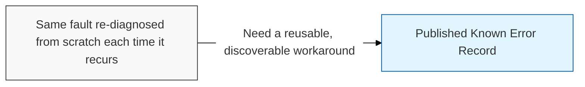
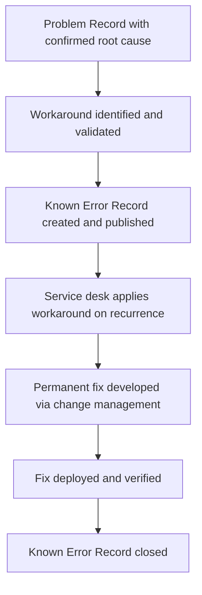

## I. Overview

A Known Error (KE) Record documents a problem for which the root cause has been diagnosed and a workaround identified, even though a permanent fix has not yet been implemented. It is owned and maintained by the problem manager or a designated technical lead, and published so service desk and incident responders can apply the workaround immediately instead of re-diagnosing the same fault. This distinction matters operationally: an incident response restores service fast using whatever workaround is on file, while the known error record is what makes that workaround discoverable and consistent across every recurrence.

## II. Structure & Process

| Field | Description |
|---|---|
| KE ID | Unique identifier linking the known error to its source Problem Record. |
| Title/Summary | Short description of the fault and its observable symptoms. |
| Root Cause | Confirmed technical cause established through root-cause analysis. |
| Workaround | Documented steps to mitigate impact until a permanent fix ships. |
| Affected Services/CIs | Systems, applications, or configuration items impacted. |
| Known Error Status | Workaround available, fix scheduled, fix deployed, or closed. |
| Linked Incidents | Incident tickets that triggered or referenced this known error. |
| Permanent Fix Reference | Change record or release that will resolve the underlying cause. |

The record is created as soon as a workaround exists, referenced by the service desk on every matching incident, and closed only after the linked permanent fix is confirmed to eliminate the root cause.

## III. Best Practices & Comparison

| Document | Primary Purpose | Trigger | Owner |
|---|---|---|---|
| Known Error (KE) Record Template | Publish a workaround for a diagnosed but unfixed root cause | Root cause confirmed, no permanent fix yet | Problem manager |
| Problem Record Template | Track investigation of a suspected root cause from open to closed | Recurring or significant incident pattern | Problem manager |
| Major Problem Report Template | Formally review a major problem's cause, impact, and lessons learned | Major problem closed or under executive review | Problem manager / service owner |

- Publish the known error as soon as a workaround is validated — do not wait for the permanent fix.
- Keep the workaround steps precise and testable so the service desk can apply them without escalation.
- Link every recurring incident back to the known error to demonstrate ongoing impact and justify fix priority.
- Review open known errors periodically to re-prioritize permanent fixes against current business risk.
- Close the record only after verifying the permanent fix removes the root cause, not merely after deployment.

Related: [Problem Record Template](../problem-record-template/), [Problem Management Process](../problem-management-process/).
